<div align="center">

# CHANAKYA

**Regulatory text → Obligation → Human sign-off → Deterministic enforcement → Audit**

A Regulatory Operating System for the Indian securities market. It compiles a SEBI circular into
a **live, bi-temporal obligation graph**, routes every AI-proposed obligation through a human
Ed25519 sign-off, and only then lets a **deterministic OPA/Rego** engine enforce it — with a
causal citation behind every claim and an auditable trail as of any date.

<br/>

[](https://www.sebi.gov.in/)
[](#)
[](LICENSE)

[](https://go.dev/)
[](https://nextjs.org/)
[](https://react.dev/)
[](https://www.typescriptlang.org/)
[](https://modernc.org/sqlite)
[](https://www.openpolicyagent.org/)
[](#the-safety-model)
[](https://tailwindcss.com/)

</div>

---

> **The AI never enforces. It only ever *proposes* obligations as data, validated against a strict
> JSON schema.** A human cryptographically signs each one, and a deterministic policy engine — not
> the model — decides compliance. Nothing is blocked before a human promotes it.

> **Note on screenshots.** Every figure below is captured live from the running app via
> [`scripts/capture_screenshots.py`](scripts/capture_screenshots.py) — no mockups; the graphs are
> real React Flow, and each data screen is backed by the Go API.

### See it in action — a SEBI amendment, end to end

CHANAKYA detects a real SEBI circular (the MITC amendment, 17 Feb 2025), computes its operational
impact, routes it through a human sign-off, and produces an audit-ready pack — one continuous flow.

| | |
|---|---|
| 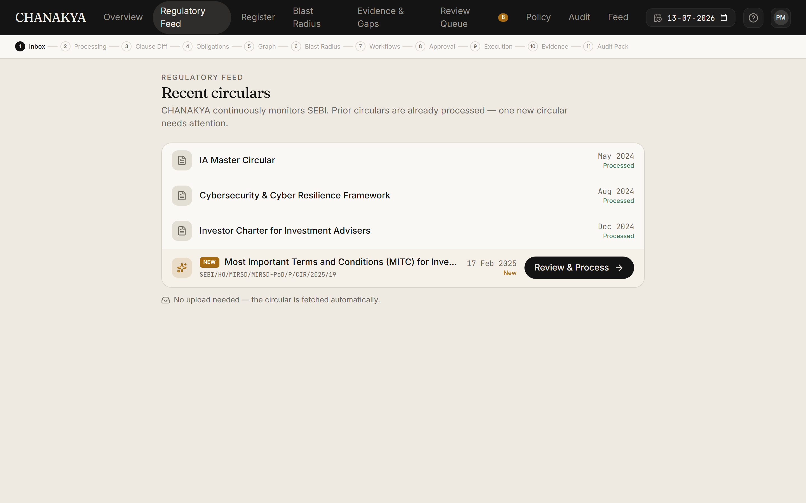 | 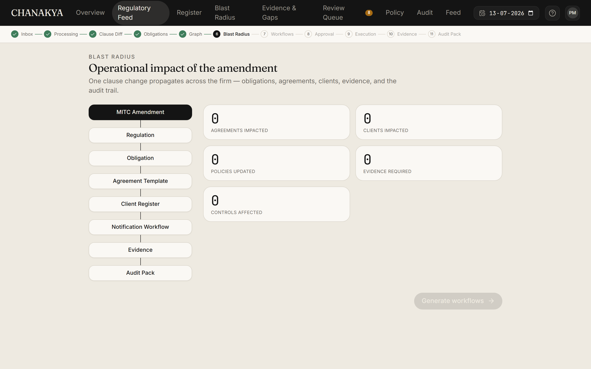 |
| **1 · Detect** — the new MITC circular arrives in the Regulatory Feed | **2 · Blast radius** — one clause change, mapped across the firm |
| 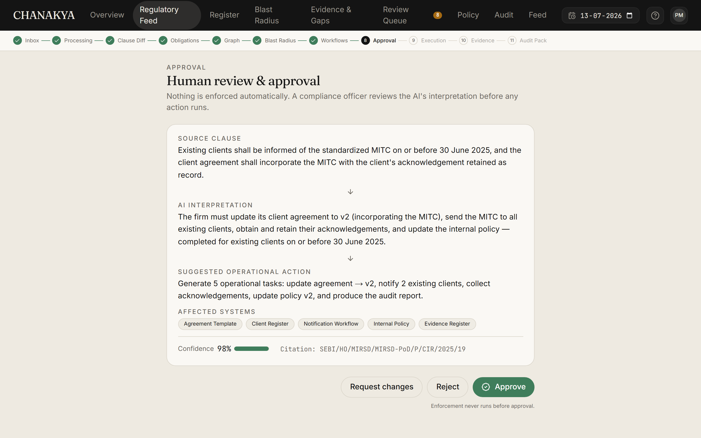 | 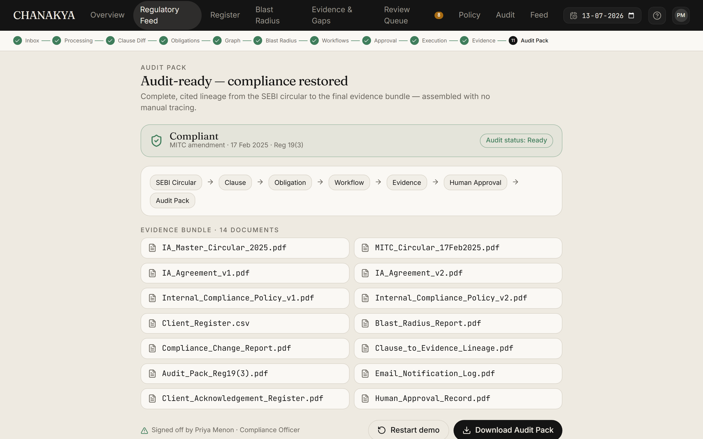 |
| **3 · Human gate** — the officer reviews and approves; nothing runs before this | **4 · Audit pack** — Reg 19(3) compliant, full evidence bundle |

---

## Table of contents

- [Overview](#overview) · [Why this is different](#why-this-is-different) · [The safety model](#the-safety-model)
- [Product walkthrough](#product-walkthrough) · [90-second demo](#90-second-demo)
- [System architecture](#system-architecture) · [Repository structure](#repository-structure) · [The compliance pipeline](#the-compliance-pipeline)
- [Key subsystems](#key-subsystems) · [Screen gallery](#screen-gallery)
- [Technology stack](#technology-stack) · [Installation](#installation) · [Running](#running) · [API reference](#api-reference)
- [Design system](#design-system) · [Roadmap](#roadmap) · [Acknowledgements](#acknowledgements) · [License](#license)

---

## Overview

Compliance in the Indian securities market is a text problem with operational stakes. A SEBI
circular is prose; a firm needs to know, at every moment: *which obligations are in force, on whom,
backed by what evidence, and enforced how* — and be able to prove it to a supervisor **as of any
past date**.

**CHANAKYA is a system of record for exactly that.** It ingests the SEBI *Investment Advisers Master
Circular*, extracts each obligation with an LLM as **schema-validated data** (never code, never a
decision), and maintains a bi-temporal graph that answers auditor-grade questions:

- *What obligations are in force, on whom, as of any given date?*
- *When this clause is amended, exactly which controls, evidence, and workflows are affected?*
- *Who signed off on treating this sentence as this obligation — and does that signature still verify?*
- *What was the compliant state as-of a past date?*

Because those answers must survive restarts and be independently auditable, CHANAKYA persists
everything in a single SQLite file. **The database is not a cache; it is the product.** See the
durable design record in [`description/ARCHITECTURE.md`](description/ARCHITECTURE.md).

<!-- screenshot: the Overview console -->
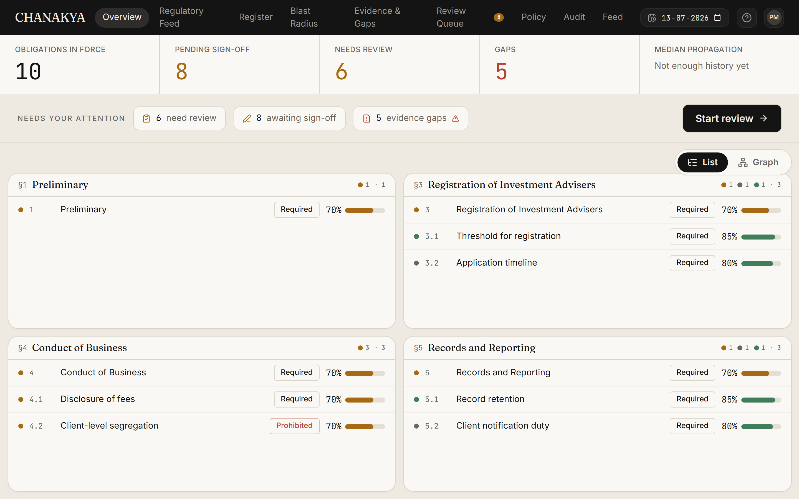

---

## Why this is different

Most "AI compliance" demos let a model read a rule and *tell you whether you comply*. That is
exactly the thing a regulator cannot trust: a black box, unauditable, ungrounded, and impossible to
sign. CHANAKYA inverts it — **the model's only job is to propose structured data; humans and
deterministic code own every consequential step.**

| | Typical LLM compliance tool | **CHANAKYA** |
|---|---|---|
| What the LLM outputs | free-text judgement / a "yes/no" | **data only**, validated against a strict JSON schema |
| Who decides compliance | the model | a **deterministic OPA/Rego** policy, reproducible bit-for-bit |
| Human control | after-the-fact review | **Ed25519 sign-off gate** — nothing enforces until a human signs |
| Grounding | often hallucinated | **causal citation required** — source clause id + exact sentence, or rejected |
| Enforcement | binary, immediate | **staged** audit → soft → hard, promoted only by a human |
| Time travel | none | **bi-temporal** — reconstruct any obligation/posture as of any date |
| Change impact | manual guesswork | **blast radius** — cosine-diff surfaces semantically affected obligations |
| Evidence | writes into systems | **read-only connectors**; gaps become *drafted* (never filed) tickets |

The thesis in one line: **a cited obligation graph, gated by a human signature and enforced by
deterministic policy — auditable end to end, and safe by construction.**

---

## The safety model

These are non-negotiable invariants, enforced across the codebase:

1. **The LLM produces DATA ONLY.** Every extraction is validated against a strict JSON schema
   ([`backend/internal/compiler/schema.json`](backend/internal/compiler/schema.json)) before it can
   enter the graph. The model never emits code and never makes an enforcement decision.
2. **Every obligation carries a causal citation** — the source clause id and the *exact* source
   sentence — or it is rejected. The UI never shows a claim you cannot trace back to text.
3. **Enforcement is deterministic and human-gated.** Compliance is decided only by the embedded
   OPA/Rego engine ([`backend/internal/policy/`](backend/internal/policy)), and only *after* a human
   Ed25519-signs the obligation ([`backend/internal/signoff/`](backend/internal/signoff)). The
   signature covers a canonical hash of the obligation excluding its status — so tampering breaks it.
4. **Enforcement is staged: `audit → soft → hard`.** New policies start in **audit** (observe only)
   and can *never* block operations automatically — a human promotes each stage.
5. **Evidence connectors are READ-ONLY.** CHANAKYA maps obligations to firm evidence and *drafts*
   remediation tickets for gaps; it never writes into a customer system.

---

## Product walkthrough

The web console is 8 routed screens under [`frontend/apps/web/app/`](frontend/apps/web/app). Every
value is monospace with its provenance; the interface leads with plain English for a compliance
officer, and keeps the machine detail one click away for an auditor.

### 1 — Overview `/`

A KPI strip (obligations in force, pending sign-off, needs-review, gaps), a **"Needs your attention"**
action row, and the obligation view as either a **scannable clause-section grid (List)** or an
**auto-laid-out graph (Graph)** — toggled and remembered for the session.

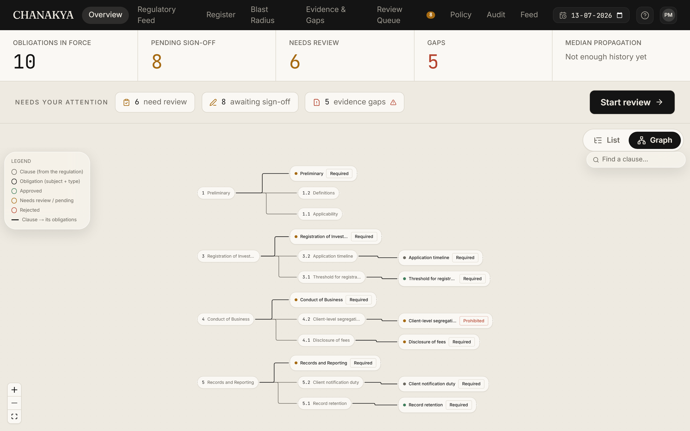

- **Implementation:** [`app/page.tsx`](frontend/apps/web/app/page.tsx),
  [`overview-hierarchy.tsx`](frontend/apps/web/components/overview-hierarchy.tsx),
  [`overview-graph.tsx`](frontend/apps/web/components/overview-graph.tsx) (dagre `layered` layout).

### 2 — Register `/register`

Every obligation, typed (Required / Prohibited / Permitted) and **cited**. Click a row → the detail
panel highlights the *exact source sentence*. Change the **as-of date** to before the circular
issued → the register empties. That is bi-temporality, visible.

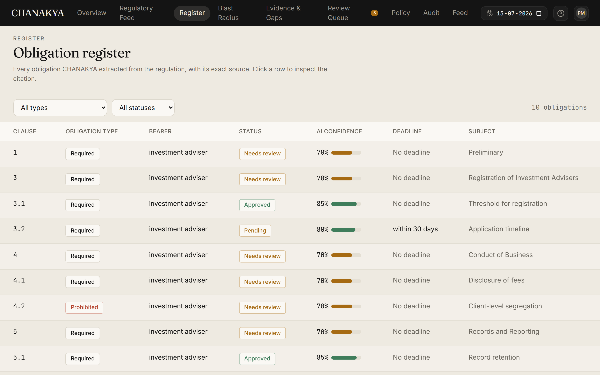

- **Implementation:** [`app/register/page.tsx`](frontend/apps/web/app/register/page.tsx),
  [`obligation-detail.tsx`](frontend/apps/web/components/obligation-detail.tsx).

### 3 — Blast Radius `/amendments`

Preview what amending a clause would touch **before** accepting it. Edit a clause, compute, and watch
the impact propagate clause → obligation → control → evidence — including **semantic** hits surfaced
by an in-Go cosine-diff (editing the fee clause lights up the registration control via the
fee-threshold obligation).

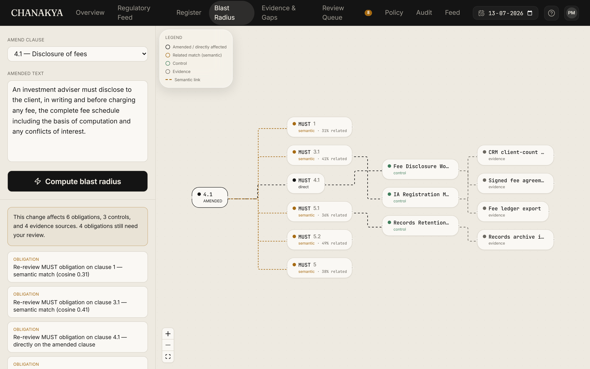

- **Implementation:** [`app/amendments/page.tsx`](frontend/apps/web/app/amendments/page.tsx),
  [`blast-graph.tsx`](frontend/apps/web/components/blast-graph.tsx);
  backend [`internal/store/blast.go`](backend/internal/store/blast.go),
  [`internal/vec/vec.go`](backend/internal/vec/vec.go).

### 4 — Evidence & Gaps `/evidence`

Which obligations are backed by evidence from the firm's **read-only** systems, and where the gaps
are. Each gap becomes a **drafted** remediation ticket (owner, deadline, citation) — drafted, never
filed.

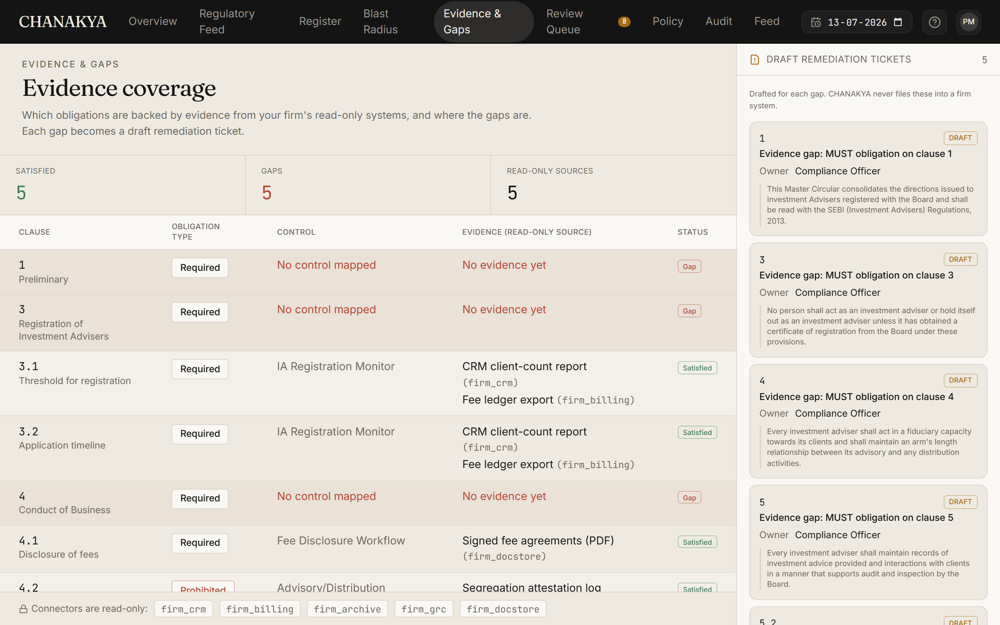

- **Implementation:** [`app/evidence/page.tsx`](frontend/apps/web/app/evidence/page.tsx);
  backend [`internal/store/evidence.go`](backend/internal/store/evidence.go),
  [`internal/store/tickets.go`](backend/internal/store/tickets.go).

### 5 — Review Queue `/review`

The compliance officer's inbox, prioritised (least-confident, nearest deadline first). Reviewing an
obligation opens the multi-step **sign-off modal** — review against the source sentence, decide,
justify, and produce an **Ed25519 signature** over the canonical obligation hash.

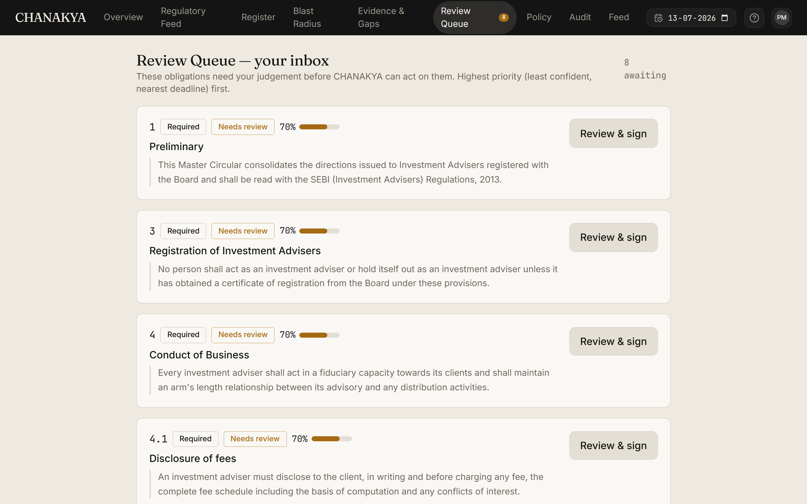

- **Implementation:** [`app/review/page.tsx`](frontend/apps/web/app/review/page.tsx),
  [`signoff-modal.tsx`](frontend/apps/web/components/signoff-modal.tsx);
  backend [`internal/signoff/signoff.go`](backend/internal/signoff/signoff.go),
  [`internal/httpapi/signoff.go`](backend/internal/httpapi/signoff.go).

### 6 — Policy `/policy`

A signed obligation compiles to a **Rego** policy. The screen leads with a **plain-English rule card**
(*Applies when… / Then it must… / in the circular's words…*), a one-click **PASS / FAIL / N-A**
verdict against firm data, and an enforcement explainer — with the Rego and firm-state JSON tucked
into a collapsible **"technical detail (for auditors)"**.

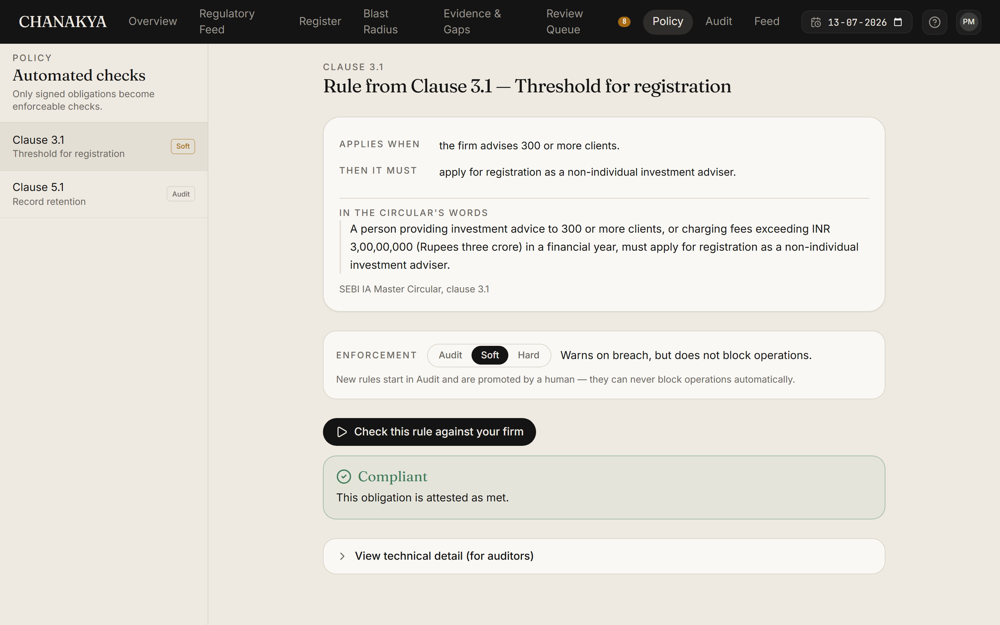

- **Implementation:** [`app/policy/page.tsx`](frontend/apps/web/app/policy/page.tsx);
  backend [`internal/policy/compile.go`](backend/internal/policy/compile.go),
  [`internal/policy/eval.go`](backend/internal/policy/eval.go).

### 7 — Audit `/audit`

The full lineage as a **layered DAG**: `Clause → Obligation → Control → Evidence → Sign-off → Policy`,
with persistent column headers and **click-to-focus** isolation of any obligation's complete chain,
reconstructed as of the selected date.

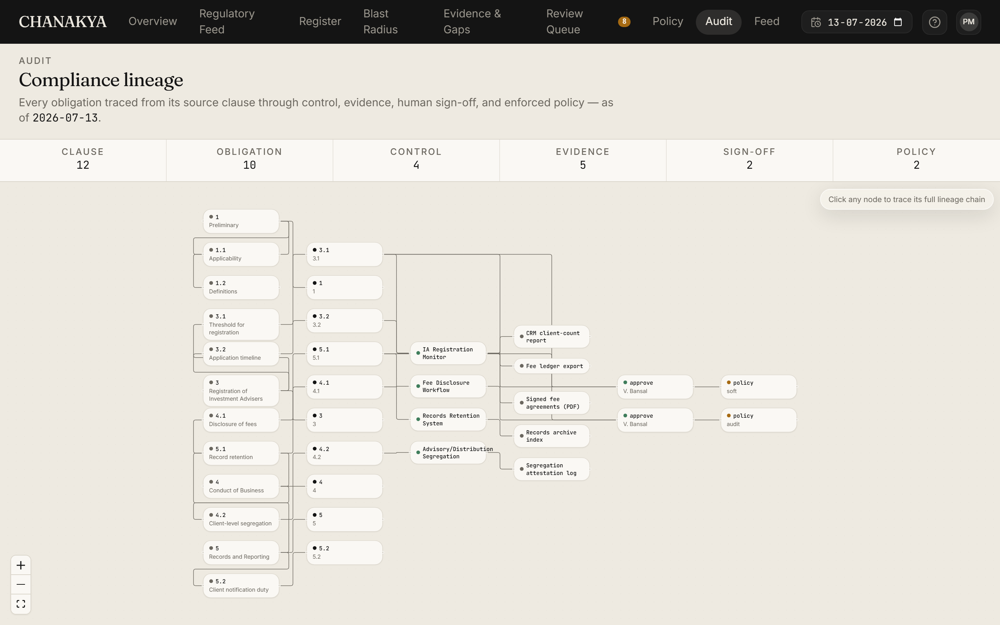

- **Implementation:** [`app/audit/page.tsx`](frontend/apps/web/app/audit/page.tsx),
  [`lineage-graph.tsx`](frontend/apps/web/components/lineage-graph.tsx);
  backend [`internal/store/lineage.go`](backend/internal/store/lineage.go).

### 8 — Feed `/feed`

A machine-readable, schema-validated **SupTech feed** of obligations, each with its causal provenance
(source sentence + sign-off), that a regulator's own systems can consume directly.

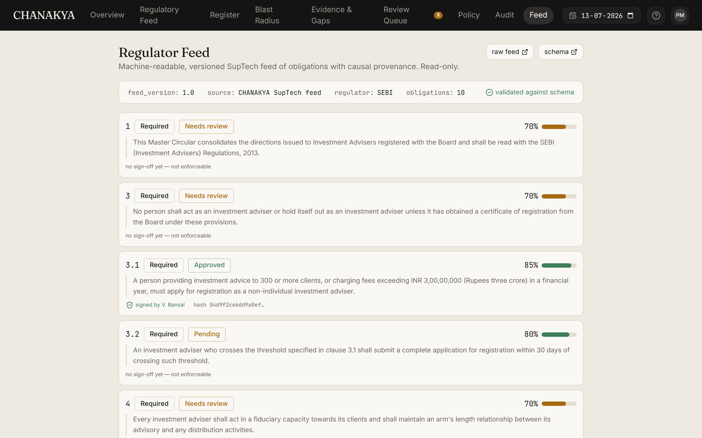

- **Implementation:** [`app/feed/page.tsx`](frontend/apps/web/app/feed/page.tsx);
  backend [`internal/feed/feed.go`](backend/internal/feed/feed.go),
  [`internal/feed/schema.json`](backend/internal/feed/schema.json).

---

## 90-second demo

The full script lives in [`description/DEMO.md`](description/DEMO.md). In short:

```mermaid
flowchart LR
    A["Overview /"] --> B["Register /register<br/>click 3.1 → citation"]
    B --> C["Blast Radius /amendments<br/>amend a clause"]
    C --> D["Evidence /evidence<br/>gap → drafted ticket"]
    D --> E["Review /review<br/>Ed25519 sign-off"]
    E --> F["Policy /policy<br/>compile → PASS/FAIL"]
    F --> G["Audit /audit<br/>trace the chain"]
    G --> H["Feed /feed<br/>SupTech export"]
    style E fill:#141414,stroke:#f59e0b,color:#eeeae1
    style F fill:#141414,stroke:#14b8a6,color:#eeeae1
```

The story: **regulatory text → operational action**, with a human gate and a cryptographic,
bi-temporal audit trail. The backend **self-seeds** the SEBI IA Master Circular on first run — no
manual seed step.

---

## System architecture

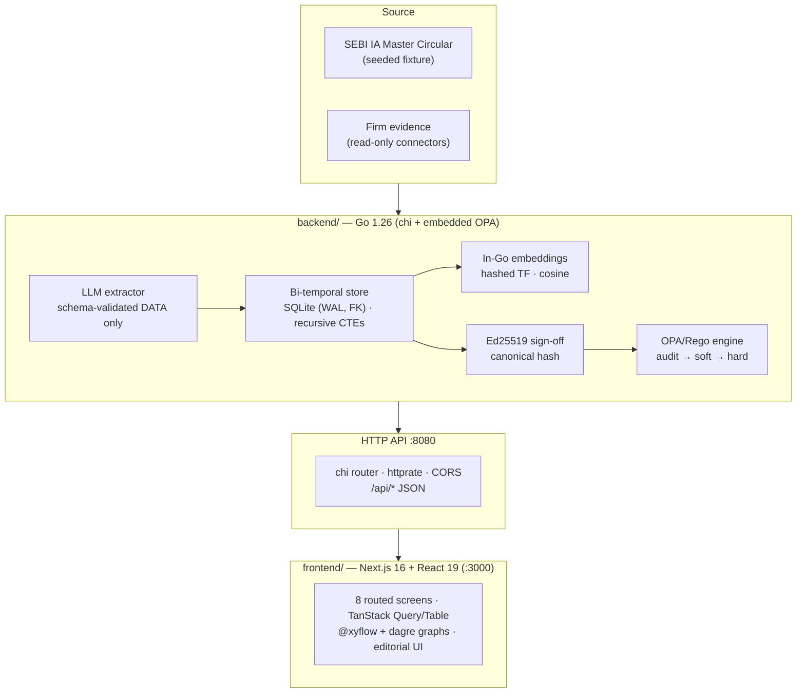

- **`backend/`** — a Go service and system-of-record. Pure-Go SQLite (`modernc.org/sqlite`, no CGO,
  no Docker), embedded OPA for deterministic evaluation, `crypto/ed25519` for sign-off, `go:embed`
  migrations. The DB self-seeds on first run.
- **`frontend/`** — a Turborepo monorepo (`apps/web` + `packages/ui`) running Next.js 16 (Turbopack)
  and React 19, talking to the Go API over HTTP. No database access from the browser.

---

## Repository structure

```
CHANAKYA/
├── README.md
├── go.work                      # Go workspace → ./backend
├── dev.ps1                      # start backend :8080 + web :3000 (Windows)
│
├── backend/                     # Go 1.26 — system of record (no Docker, no Postgres)
│   ├── cmd/
│   │   ├── api/                 #   HTTP server entrypoint (:8080, self-seeds)
│   │   ├── compile/             #   offline policy-compile CLI
│   │   └── seed/                #   explicit seeder
│   ├── db/
│   │   ├── embed.go             #   go:embed migrations
│   │   └── migrations/*.sql     #   0001_meta … 0006_policy
│   └── internal/
│       ├── store/               #   bi-temporal SQLite store (obligations, graph,
│       │                        #     lineage, evidence, tickets, blast, signoff, feed)
│       ├── llm/                 #   schema-validated extraction (offline + Anthropic)
│       ├── compiler/            #   JSON-schema validation (santhosh-tekuri/v6)
│       ├── policy/              #   Rego compile + OPA eval (staged enforcement)
│       ├── signoff/             #   Ed25519 canonical hash + verify
│       ├── vec/                 #   hashed-TF embeddings + cosine (blast radius)
│       ├── feed/                #   SupTech feed + JSON schema
│       ├── fixtures/            #   SEBI IA circular + controls seed data
│       ├── httpapi/             #   chi handlers for every /api/* route
│       ├── bootstrap/ · config/ · domain/
│
├── frontend/                    # Turborepo (npm workspaces) — the web console
│   ├── package.json · turbo.json · tsconfig.json
│   ├── apps/web/                #   Next.js 16 app
│   │   ├── app/                 #     8 routes (page.tsx, register, amendments,
│   │   │                        #       evidence, review, policy, audit, feed)
│   │   ├── components/          #     app-shell, graphs, modals, badges, …
│   │   └── lib/                 #     api.ts (typed client) · format.ts
│   └── packages/                #   ui (design system) · eslint-config · typescript-config
│
├── description/                 # Design records & agent docs
│   ├── ARCHITECTURE.md          #   durable design record (updated every phase)
│   ├── DEMO.md                  #   90-second demo script
│   └── AGENTS.md                #   agent working rules
│
└── docs/screenshots/            # README figures (add your captures here)
```

---

## The compliance pipeline

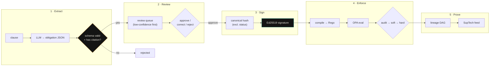

Every step is bi-temporal and replayable: the store records both **world time** (`valid_from` /
`valid_to`) and **system time** (`tx_from` / `tx_to`), so any view can be reconstructed as of any
date via recursive CTEs.

---

## Key subsystems

### Bi-temporal system of record
`valid_from/valid_to` (when an obligation is *true in the world*) and `tx_from/tx_to` (when the
system *knew* it) are tracked independently. As-of queries walk the clause hierarchy with recursive
CTEs. SQLite runs in WAL mode with foreign keys on and a single writer
([`backend/internal/store/store.go`](backend/internal/store/store.go)).

### Schema-validated extraction
The LLM returns obligation objects that must pass
[`schema.json`](backend/internal/compiler/schema.json) (strict, via `santhosh-tekuri/jsonschema/v6`)
**and** carry a causal citation, or they are dropped. An offline deterministic extractor
([`internal/llm/offline.go`](backend/internal/llm/offline.go)) makes the demo reproducible; an
Anthropic path ([`internal/llm/anthropic.go`](backend/internal/llm/anthropic.go)) is drop-in.

### In-Go semantic blast radius
No external vector DB: [`internal/vec/vec.go`](backend/internal/vec/vec.go) builds L2-normalized
hashed term-frequency vectors (dim 256) and scores cosine similarity. An amendment's edited text is
diffed against every obligation to surface **semantically** affected ones that no structural link
would catch.

### Ed25519 human sign-off
[`internal/signoff/signoff.go`](backend/internal/signoff/signoff.go) hashes a **canonical**
serialization of the obligation *excluding its mutable status*, signs it, and verifies later. If the
obligation text is altered after signing, verification fails — the audit trail is tamper-evident.

### Deterministic staged enforcement
[`internal/policy/compile.go`](backend/internal/policy/compile.go) turns a signed obligation into
Rego (distinguishing *trigger* thresholds that gate applicability from *requirement* thresholds that
are themselves the duty). [`eval.go`](backend/internal/policy/eval.go) runs it on embedded OPA with a
`topdown` trace, returning `applicable / compliant / denies / blocked` — never enforcing past the
current stage.

---

## Screen gallery

| | |
|---|---|
|  |  |
| **Overview** — posture, attention, list/graph | **Register** — typed, cited obligations |
|  |  |
| **Blast Radius** — impact propagation | **Evidence & Gaps** — drafted tickets |
|  |  |
| **Review** — Ed25519 sign-off | **Policy** — plain-English rule + verdict |
|  |  |
| **Audit** — layered lineage DAG | **Feed** — SupTech provenance |

---

## Technology stack

| Layer | Technology |
|---|---|
| **Backend** | Go 1.26 · chi v5 (router) · httprate (rate limit) · CORS |
| **Storage** | `modernc.org/sqlite` — pure-Go SQLite (WAL, FK), **no Docker, no Postgres** |
| **Policy engine** | Embedded **OPA / Rego** (`open-policy-agent/opa`) with `topdown` trace |
| **Validation** | `santhosh-tekuri/jsonschema/v6` (strict JSON-Schema) |
| **Crypto** | `crypto/ed25519` — human sign-off over a canonical obligation hash |
| **Embeddings** | In-Go hashed term-frequency vectors + cosine (no external vector DB) |
| **Frontend** | Next.js 16 (Turbopack) · React 19 · TypeScript 5 |
| **Monorepo** | Turborepo · npm workspaces (`apps/web` + `packages/ui`) |
| **Data / tables** | TanStack Query · TanStack Table |
| **Graphs** | `@xyflow/react` · `@dagrejs/dagre` (layered auto-layout) |
| **Styling** | Tailwind CSS v4 (CSS-first `@theme`) · Fraunces · Inter · JetBrains Mono |
| **Motion** | Framer Motion (with `prefers-reduced-motion`) |

---

## Installation

Prerequisites: **Go 1.26+** and **Node 20+**. No Docker, no external database — the backend creates
and self-seeds `./chanakya.db` on first run.

```bash
git clone https://github.com/mridulbansal4/Chanakya.git
cd Chanakya
```

**Windows (PowerShell) — one command**

```powershell
.\dev.ps1        # starts the Go backend (:8080) and the Next.js web app (:3000)
```

**Manual (any OS)**

```bash
# 1) backend — from the repo root (uses go.work)
go run ./backend/cmd/api           # http://localhost:8080  (self-seeds chanakya.db)

# 2) frontend — in a second terminal
cd frontend
npm install
npm run dev                        # http://localhost:3000
```

> The Anthropic extraction path is optional; by default the deterministic **offline** extractor runs,
> so the whole system works with no API key. Copy `backend/.env.example` /
> `frontend/apps/web/.env.example` if you want to override defaults.

---

## Running

| Command | From | Purpose |
|---|---|---|
| `.\dev.ps1` | repo root | Start backend + web together (Windows) |
| `go run ./backend/cmd/api` | repo root | Go API on `:8080` (self-seeds on first run) |
| `go test ./backend/...` | repo root | Backend test suite (table-driven) |
| `npm run dev` | `frontend/` | Turbopack dev server on `:3000` |
| `npm run build` | `frontend/` | Type-check + production build |
| `npm run typecheck` | `frontend/` | `tsc --noEmit` across the workspace |

---

## API reference

All endpoints are JSON over HTTP on `:8080`; the typed client is
[`frontend/apps/web/lib/api.ts`](frontend/apps/web/lib/api.ts). Most reads accept an `as_of` date.

| Method & path | Returns |
|---|---|
| `GET /health` | service + database health |
| `GET /api/posture` | obligations in force, pending, needs-review, gaps |
| `GET /api/obligations` · `GET /api/obligation?id=` | obligation list / one obligation + clause text |
| `GET /api/graph` | clause↔obligation graph (Overview) |
| `GET /api/clauses` | the seeded circular's clause tree |
| `POST /api/amendments/blast-radius` | structural + semantic impact of an amendment |
| `GET /api/evidence` · `GET /api/tickets` | evidence coverage / drafted remediation tickets |
| `GET /api/review-queue` · `POST /api/signoff` · `GET /api/signoff?obligation_id=` | queue · Ed25519 sign-off · verification |
| `GET /api/policies` · `GET /api/firm-state` | compilable obligations · read-only firm facts |
| `POST /api/policy/compile` · `GET /api/policy?obligation_id=` | compile to Rego · fetch policy + eval |
| `POST /api/policy/stage` · `POST /api/policy/evaluate` | promote audit→soft→hard · evaluate on firm state |
| `GET /api/lineage` | the audit DAG as of a date |
| `GET /api/feed` · `GET /api/feed/schema` | SupTech feed · its JSON schema |

---

## Design system

The UI is **"Editorial"** — a restrained black + warm-cream system: warm cream app background,
near-white data surfaces, near-black nav/hero panels, and a single rare lavender accent. Colour is
either neutral or a **status** (ok / warn / risk) — never decoration.

| Token group | Values |
|---|---|
| **Ink / cream** | `--ink #141414` · `--cream #EEEAE1` · `--surface #FAF8F4` · `--line #DAD5CA` |
| **Status** | ok `#3F7D5B` · warn `#A66A12` · risk `#B4432E` |
| **Accent** | lavender `#C9C2F0` (used sparingly) |
| **Type** | Fraunces (display serif) · Inter (UI) · JetBrains Mono (all machine values) |

Tokens live in
[`frontend/packages/ui/src/styles/globals.css`](frontend/packages/ui/src/styles/globals.css).
Accessibility is first-class: visible focus rings, keyboard-operable modals, `prefers-reduced-motion`
support, and loading skeletons.

---

## Roadmap

- **Live regulation ingest** — parse SEBI circulars directly (PDF/HTML) instead of the seeded
  fixture; incremental re-extraction on amendment.
- **Multi-circular & multi-firm** — beyond the Investment Advisers circular; per-firm evidence
  connectors (still read-only).
- **Richer policy library** — more threshold kinds, temporal obligations, and cross-obligation
  constraints in Rego.
- **Signed feed distribution** — cryptographically signed SupTech feed endpoints for regulator
  systems to poll.

---

## Acknowledgements

- **SEBI** — the Investment Advisers Master Circular and the TechSprint 2026 "Agentic Compliance"
  problem statement.
- **Open Policy Agent** — the embedded Rego engine that makes enforcement deterministic and auditable.
- **modernc.org** — a pure-Go SQLite that keeps the system Docker-free and single-binary.

---

## License

Released under the [MIT License](LICENSE).

<div align="center">
<br/>
<sub><b>CHANAKYA</b> — Regulatory Operating System · text → obligation → sign-off → enforcement → audit</sub>
</div>
