<div align="center">

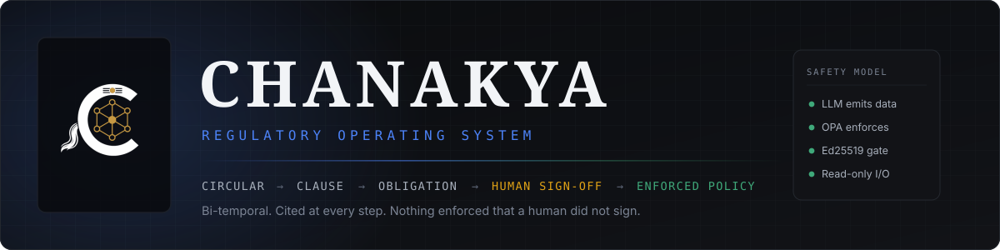

<br/>

**Circular → Clause → Obligation → Human sign-off → Enforced policy**

A regulatory operating system for the Indian securities market. It ingests a SEBI circular,
compiles it into cited obligations, shows exactly which parts of a firm each one touches, and
enforces nothing until a human has cryptographically signed it.

<br/>

[](https://www.sebi.gov.in/)
[](#the-safety-model)
[](LICENSE)

[](https://go.dev/)
[](https://nextjs.org/)
[](https://react.dev/)
[](https://www.typescriptlang.org/)
[](https://tailwindcss.com/)
[](https://www.openpolicyagent.org/)
[](https://www.sqlite.org/)
[](#6--review-queue--ed25519-sign-off)

</div>

---

> **Nothing is enforced that a human did not sign, and nothing enters the graph without a verbatim citation.**
> Those two sentences are not marketing copy: they are invariants enforced by database constraints,
> a substring check, a compile gate that returns `409`, and a test suite that fails if you weaken them.

> **Note on figures.** Every screenshot below is captured from the running application against a live
> backend by [`scripts/capture_screenshots.py`](scripts/capture_screenshots.py). Nothing is mocked-up,
> redrawn, or hand-edited.

---

## Table of contents

- [Overview](#overview) · [Why this is different](#why-this-is-different) · [The safety model](#the-safety-model)
- [Product walkthrough](#product-walkthrough) · [System architecture](#system-architecture)
- [The ingestion pipeline](#the-ingestion-pipeline) · [How a regulation becomes enforcement](#how-a-regulation-becomes-enforcement)
- [The firm as data](#the-firm-as-data) · [Repository structure](#repository-structure)
- [Technology stack](#technology-stack) · [Installation](#installation) · [Running](#running)
- [API surface](#api-surface) · [Feature matrix](#feature-matrix) · [Testing & adversarial guarantees](#testing--adversarial-guarantees)
- [Design system](#design-system) · [Roadmap](#roadmap) · [License](#license)

---

## Overview

A SEBI-registered investment adviser is governed by circulars that arrive as PDFs, amend each other
in place, and cross-reference regulations by number. Compliance teams read them by hand, translate
them into internal policy by hand, and rediscover (usually during an inspection) that a clause
amended eighteen months ago never propagated to the client agreement template.

CHANAKYA is a **system of record** for that problem. It maintains a bi-temporal graph that answers
auditor-grade questions:

- *What obligations are in force, on whom, **as of any given date**?*
- *When this clause is amended, exactly which controls, evidence, documents, systems, departments
  and **named clients** are affected?*
- *Who signed off on treating this sentence as this obligation, and does that signature **still verify**
  against the obligation's current content?*
- *What was the compliant state as-of a **past** date: not what we believe today?*

Because those answers must survive restarts and be independently auditable, everything persists in a
single SQLite file. The database is not a cache; it is the product.

---

## Why this is different

Most "AI for compliance" systems stop at extraction: a model reads a PDF and emits a list of rules.
That is the easy half, and it is the half that cannot be trusted in an inspection. CHANAKYA is built
around the assumption that **the model is the least trustworthy component in the system**.

| | Typical LLM compliance tool | **CHANAKYA** |
|---|---|---|
| Model output | consumed directly | **untrusted DATA**, re-validated against a strict JSON schema with `additionalProperties: false` |
| Provenance | "summarised from the circular" | **mandatory**: source clause id + verbatim source sentence, `NOT NULL` in the schema and substring-checked against the clause text |
| Enforcement | the model decides | **only** deterministic OPA/Rego, and **only** after an Ed25519 sign-off (`409` otherwise) |
| Rollout | on/off | **staged** `audit → soft → hard`; nothing hard-blocks before a signature exists |
| Amendments | overwrite the old text | **bi-temporal supersession**: the prior version stays queryable forever |
| Impact analysis | a list of clause numbers | **named** clients, advisers, departments and department heads |
| Connectors | read/write integrations | **read-only enforced by the type system**: the interface has no write method to call |
| Remediation | files tickets for you | **drafts** tickets; `state='draft'` re-enforced at the store boundary |
| Time travel | "current state" only | every screen takes an **as-of date** and reconstructs world time + system time |

The thesis in one line: **the value is not in reading the regulation: it is in being able to prove,
afterwards, exactly why the firm did what it did.**

---

## The safety model

Five invariants. They are restated at every phase, and each one is pinned by a test that fails if a
future change weakens it.

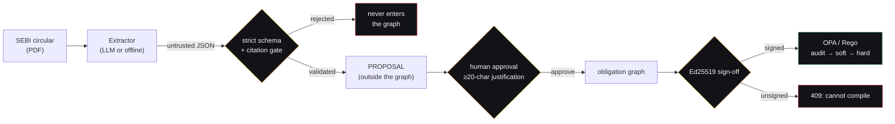
```mermaid
flowchart LR
    PDF["SEBI circular<br/>(PDF)"] --> EXT["Extractor<br/>(LLM or offline)"]
    EXT -->|"untrusted JSON"| VAL{"strict schema<br/>+ citation gate"}
    VAL -->|"rejected"| DROP["never enters<br/>the graph"]
    VAL -->|"validated"| PROP["PROPOSAL<br/>(outside the graph)"]
    PROP --> HUMAN{"human approval<br/>≥20-char justification"}
    HUMAN -->|"approve"| GRAPH["obligation graph"]
    GRAPH --> SIGN{"Ed25519 sign-off"}
    SIGN -->|"signed"| REGO["OPA / Rego<br/>audit → soft → hard"]
    SIGN -->|"unsigned"| BLOCK["409: cannot compile"]
    style VAL fill:#121317,stroke:#e0a215,color:#f2f4f7
    style HUMAN fill:#121317,stroke:#e0a215,color:#f2f4f7
    style SIGN fill:#121317,stroke:#e0a215,color:#f2f4f7
    style REGO fill:#121317,stroke:#3fa97a,color:#f2f4f7
    style DROP fill:#121317,stroke:#e5484d,color:#f2f4f7
    style BLOCK fill:#121317,stroke:#e5484d,color:#f2f4f7
```

**1: The LLM produces DATA, never code, never enforcement.**
Every extractor response is validated against [`compiler/schema.json`](backend/internal/compiler/schema.json)
with `additionalProperties: false`. A model that tries to smuggle an `"exec"` field is rejected at the
schema boundary, not at review time.

**2: Provenance is mandatory.**
Every obligation carries `source_clause_ref` and `source_sentence`. The claim is checked three times:
the schema `required` block, a compiler check that the sentence is a **verbatim substring** of the
clause text, and `NOT NULL` columns in SQLite. A hallucinated citation cannot be stored.

**3: Enforcement is deterministic and gated.**
`POST /api/policy/compile` returns **409** unless the obligation is `approved` *and* carries an
approving Ed25519 sign-off. Only [`internal/policy`](backend/internal/policy) evaluates, via the
embedded OPA engine.

**4: Enforcement is staged: `audit → soft → hard`.**
Policies are created at `audit`. Only `hard` marks a decision `blocked`. Nothing hard-blocks before a
signature exists.

**5: Evidence connectors are READ-ONLY, by type.**
The `Connector` interface exposes exactly `Descriptor`, `Health`, `Fetch`. There is no `Write`, no
`Send`, no `Delete`: not unimplemented, **absent**. `TestConnectorInterfaceHasNoWriteMethod` asserts
this reflectively, so adding one fails CI.

---

## Product walkthrough

Twelve screens, every one driven by a global **as-of date** control in the header. Every data value is
monospace; the word "confirmed" never appears next to an unsigned obligation.

### 1: Overview `/`

The compliance officer's status board: obligations in force, awaiting sign-off, needing review, open
evidence gaps. Below it, the regulation itself: as a chapter hierarchy, or as the clause→obligation
graph.

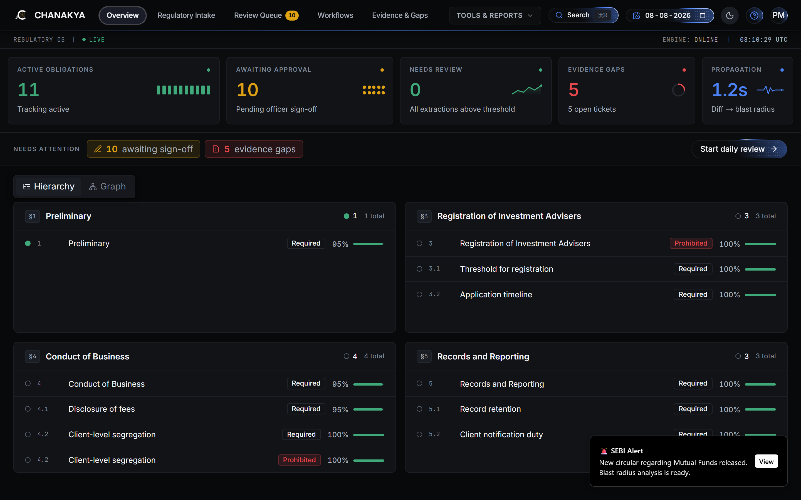

The same data, as the provenance graph. Every obligation node hangs off the clause it was cited from;
colour carries status, never decoration.

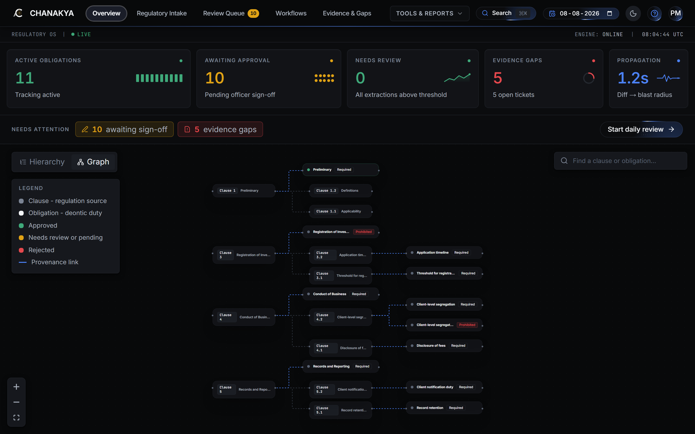

### 2: Regulatory Intake `/ingest`

Upload a circular. Stage 0 runs **synchronously** (its rejections are answers you need immediately) 
then the request returns `202` with an ingest id and the pipeline continues on a worker, streaming
progress over SSE.

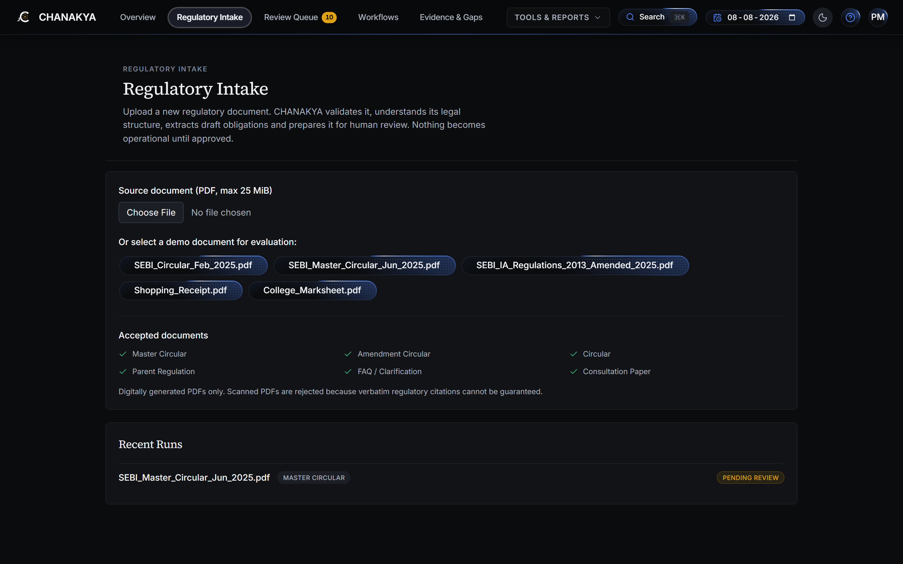

Note what the screen refuses: **scanned PDFs are rejected**, because OCR output cannot support the
verbatim-citation guarantee. That is a product decision, not a limitation: and the intake history
shows `Shopping_Receipt.pdf` and `College_Marksheet.pdf` failing, because a document that is not a
regulation should not silently produce obligations.

- Content-addressed by SHA-256: re-uploading the same bytes returns the **existing** run rather than
  starting a second one.
- Nothing reaches `circular` / `clause` / `obligation` until `POST /api/ingest/{id}/approve`.

### 3: Review Queue `/review`

The human gate, and the daily inbox. Each pending obligation is shown beside the exact sentence it
was extracted from, with the extractor's confidence.

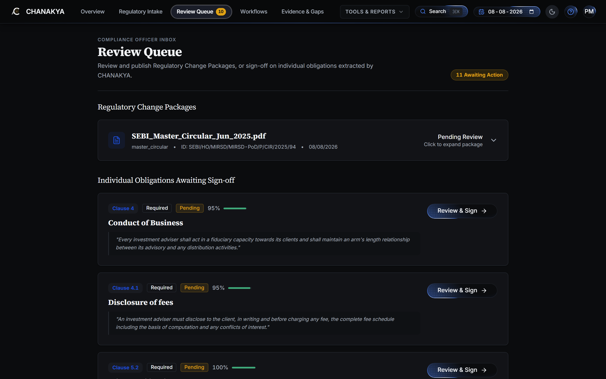

"Review & Sign" opens a deliberate three-step modal: **Review → Decide → Sign**. The reviewer may
correct the deontic type or deadline, must type a **≥20-character justification** (Continue is gated
on it: *friction is a feature*), and only then is an Ed25519 signature produced over the obligation's
canonical content.

Because the signature covers *content* and not status, later tampering is detectable:
`GET /api/signoff` re-derives the canonical form of the **current** obligation and reports
`valid: false` with mismatched hashes if anything material changed.

### 4: Blast Radius `/amendments`

The question the product exists to answer. Amend a clause, and watch the impact propagate
clause → obligation → control → evidence, layer by layer.

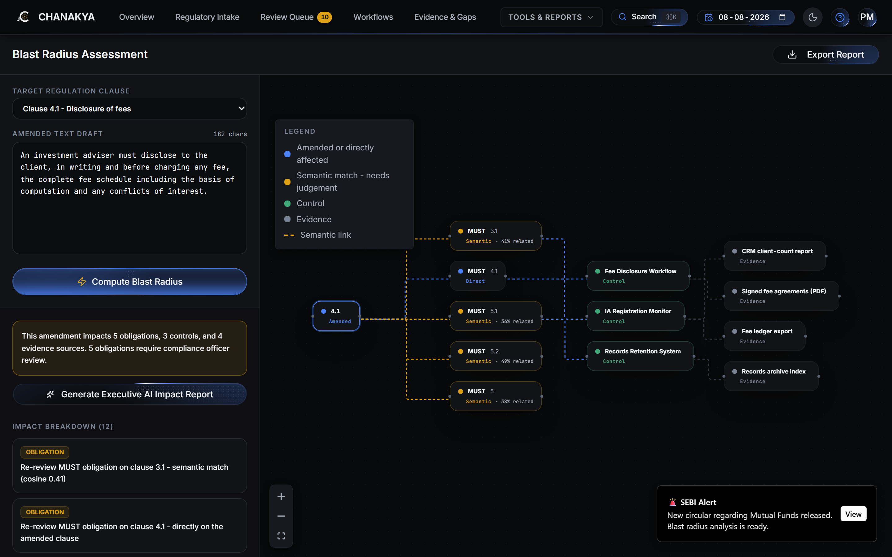

Editing clause 4.1 (fee disclosure) hits its own obligation directly: and **semantically** pulls in
3.1, 5.1, 5.2 and 5 at 41%, 36%, 49% and 38% cosine similarity, which propagate to the *IA Registration
Monitor* and *Records Retention System* controls. That last hop is the non-obvious one: a fee-disclosure
amendment creating work in records retention is exactly the connection a manual review misses.

Nothing here is persisted. It is a read-only what-if.

### 5: Workflows `/workflows`

Approved obligations become draft task DAGs. The operative verb selects a reviewed template from a
**closed 25-verb vocabulary** through a fixed lookup table: no LLM, no similarity score.

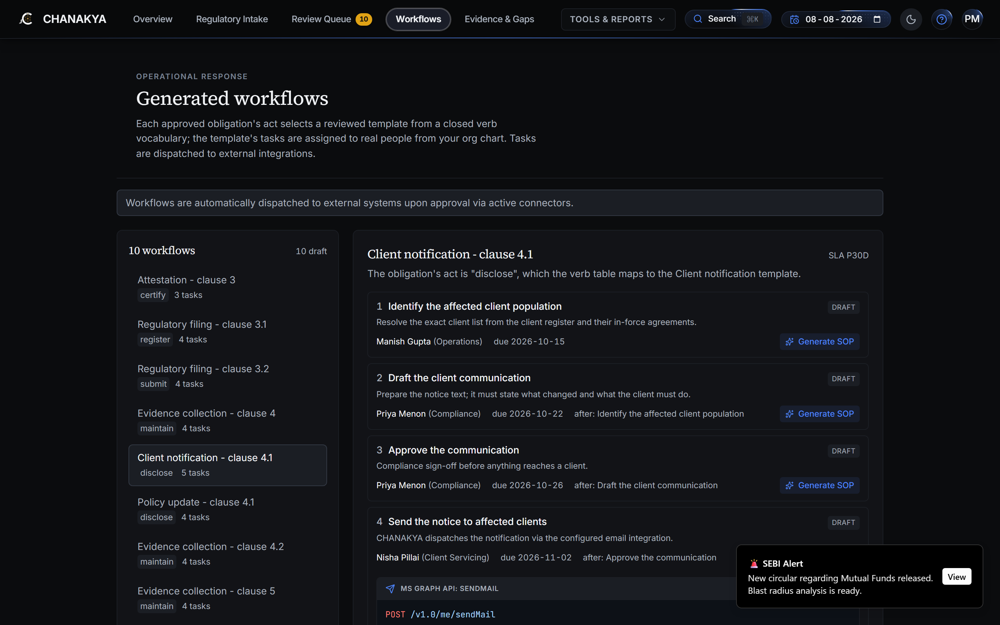

- `disclose` → *Policy update* **and** *Client notification* (a disclosure change needs both).
- An **unrecognised verb is routed to review as unclassified**: never mapped to the nearest-looking
  template, because a firm's operational plan should not rest on a fuzzy match.
- Owners resolve to **real people** from the org chart (Manish Gupta, Priya Menon, Nisha Pillai above).
  A role with no resolvable department head leaves the task **unassigned and flagged**, rather than
  putting a real person's name against work nobody agreed they own.
- Every task is `DRAFT`. `store.ApproveWorkflow` records the human decision and moves **nothing** out
  of draft: pinned by `TestApproveWorkflowDispatchesNothing`.

### 6: Evidence & Gaps `/evidence`

Which obligations are actually backed by evidence, and where the holes are.

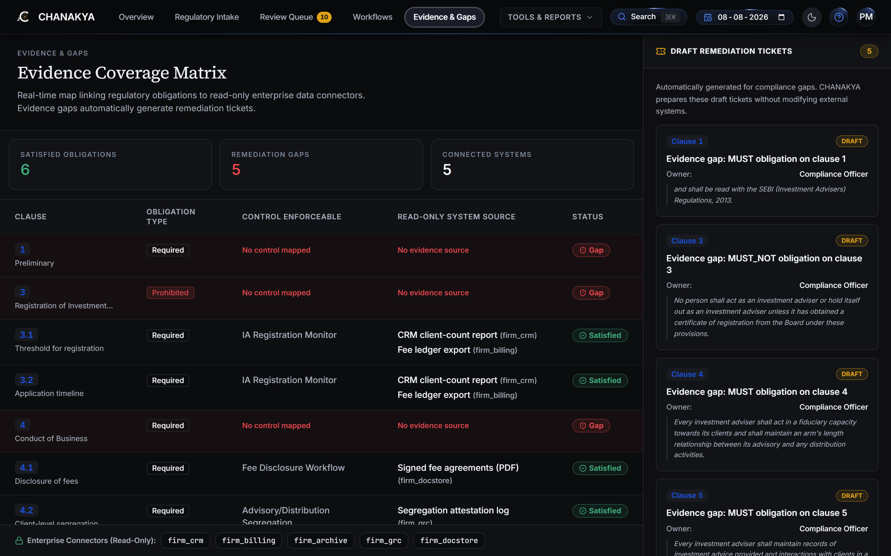

Each row traces obligation → control → the read-only system that supplies the evidence
(`firm_crm`, `firm_billing`, `firm_archive`, `firm_grc`, `firm_docstore`). Where no control is mapped,
the row is a **Gap** and a remediation ticket is drafted with the obligation's citation attached.

CHANAKYA **drafts** tickets. It never files them into a customer system: the `state` enum includes
`filed`/`resolved` for lifecycle completeness, but only `draft` is ever written.

### 7: Policy `/policy`

A signed obligation compiles to a deterministic Rego module. The obligation's numeric threshold
becomes the **applicability gate**, so the policy is silent on firms it does not apply to.

Real output, compiled from the signed clause-1 obligation:

```rego
# CHANAKYA compiled policy - deterministic, generated from a SIGNED obligation.
# obligation: SEBI/IA/MC/2024#1/obl/5b861d25bbf4
# clause: 1
# deontic: MUST

package chanakya.policy

default compliant := false

# No numeric threshold - the obligation always applies.
applicable := true

# Compliant when the firm attests this obligation is satisfied.
compliant if {
	applicable
	input.attestations["SEBI/IA/MC/2024#1/obl/5b861d25bbf4"] == true
}

deny contains msg if {
	applicable
	not input.attestations["SEBI/IA/MC/2024#1/obl/5b861d25bbf4"]
	msg := sprintf("clause %s (%s): applies but is not attested as satisfied", ["1", "MUST"])
}
```

Evaluation returns `{compliant, applicable, denies, trace}`: the OPA trace included, because a
compliance decision a firm cannot explain is not usable. A threshold obligation with the firm below
the threshold returns **not applicable**, which is a different answer from *compliant*.

### 8: Audit `/audit`

The whole chain, reconstructed as of any date.

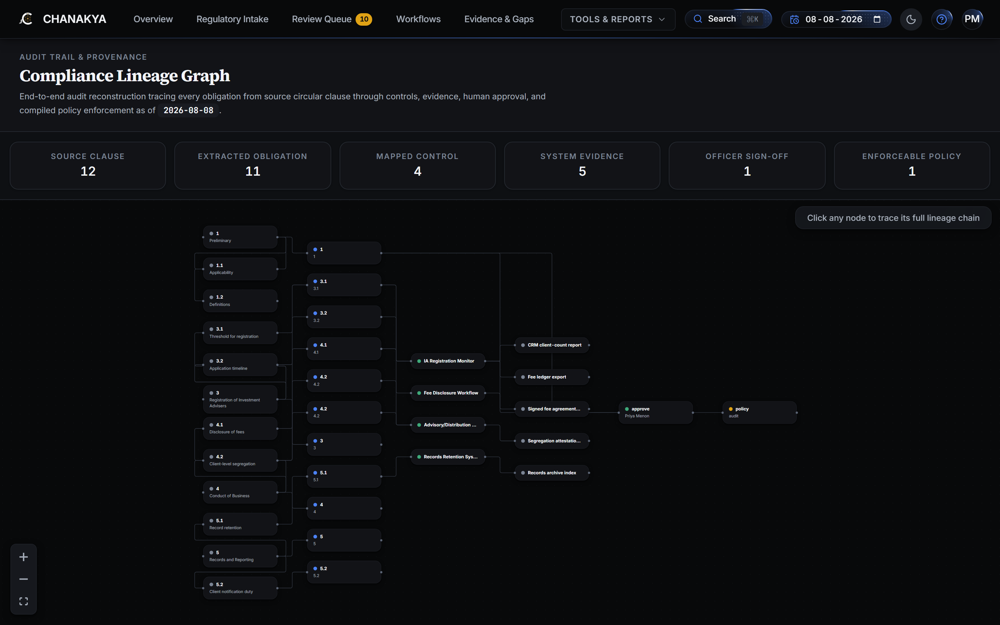

Six columns: source clause → extracted obligation → mapped control → system evidence → officer
sign-off → enforceable policy. The chain above terminates in `approve: Priya Menon` and a `policy`
node at stage `audit`.

Set the as-of date to before the signature was made and the sign-off and policy nodes **disappear** :
a signature is a world-time fact from the moment it is made, not retroactively at the circular's issue
date. That is the entire point of the bi-temporal model.

### 9: Regulator Feed `/feed`

The machine-readable SupTech feed a regulator's own systems could consume: every obligation with its
verbatim provenance, extractor confidence, and the Ed25519 sign-off where one exists.

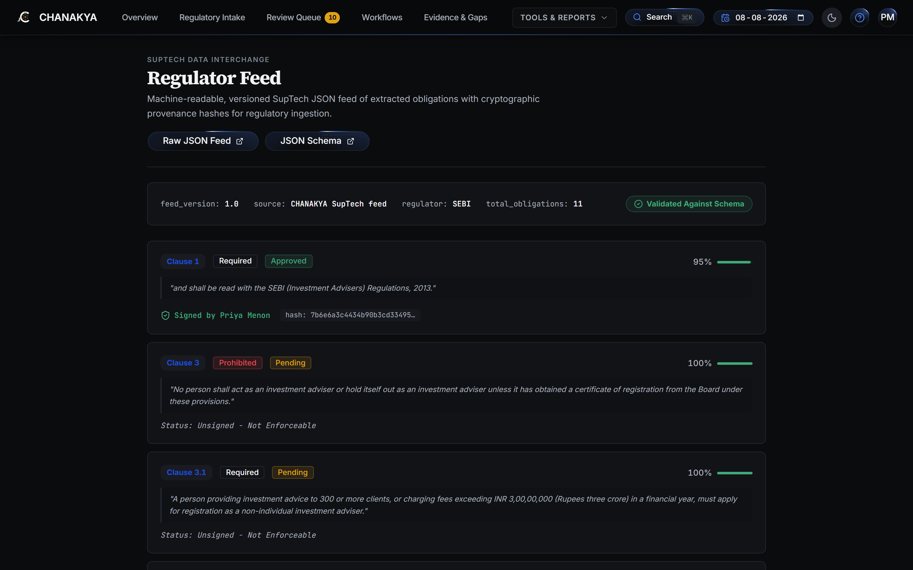

The feed **self-validates against its own JSON Schema before emission** and returns `500` if it fails :
an invalid feed is never served. Unsigned obligations are labelled `Unsigned: Not Enforceable` rather
than quietly omitted.

### 10: Obligation Register `/register`

Every obligation extracted from the corpus, filterable by deontic type and status, with extraction
confidence. Clicking a row reveals the full record and highlights the exact source sentence inside its
clause.

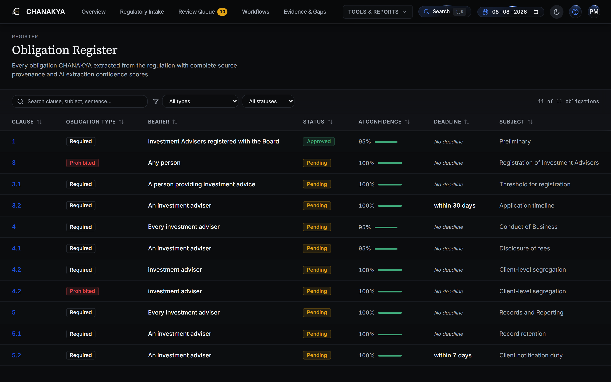

### 11: Regulatory Corpus `/regulatory-feed`

Which circulars the graph holds, how each one arrived, what it supersedes, and (for an amendment) 
the clause-level diff that was applied at approval.

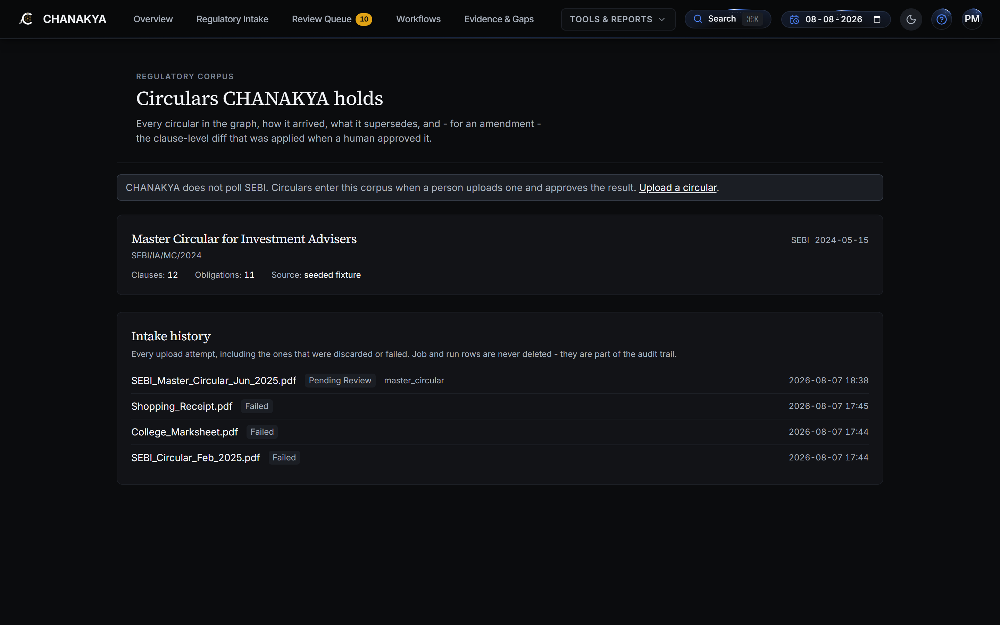

The honesty statement is **served by the API**, not written into the page: *"CHANAKYA does not poll
SEBI. Circulars enter this corpus when a person uploads one and approves the result."* Keeping it in
the API means the copy cannot drift from what the system actually does.

Intake history retains every attempt, including failures. Job and run rows are **never deleted** :
they are part of the audit trail.

### 12: Company `/company`

The firm's own record: registration certificates, governance documents, data-residency posture, and
the OAuth scopes granted to CHANAKYA.

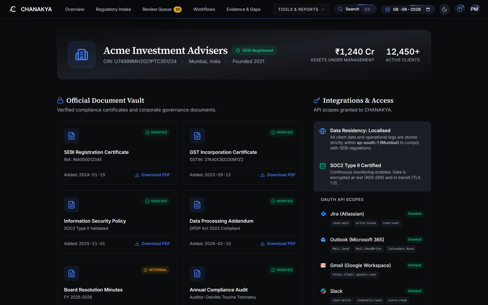

---

## System architecture

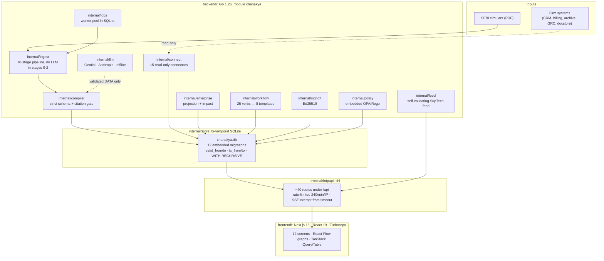
```mermaid
flowchart TB
    subgraph SRC["Inputs"]
        PDF["SEBI circulars (PDF)"]
        FIRM["Firm systems<br/>(CRM, billing, archive, GRC, docstore)"]
    end

    subgraph BACK["backend/: Go 1.26, module chanakya"]
        ING["internal/ingest<br/>10-stage pipeline, no LLM in stages 0-2"]
        COMP["internal/compiler<br/>strict schema + citation gate"]
        LLMP["internal/llm<br/>Gemini · Anthropic · offline"]
        CONN["internal/connect<br/>15 read-only connectors"]
        ENT["internal/enterprise<br/>projection + impact"]
        WF["internal/workflow<br/>25 verbs → 8 templates"]
        SIGN["internal/signoff<br/>Ed25519"]
        POL["internal/policy<br/>embedded OPA/Rego"]
        FEED["internal/feed<br/>self-validating SupTech feed"]
        JOBS["internal/jobs<br/>worker pool in SQLite"]
    end

    subgraph DB["internal/store: bi-temporal SQLite"]
        SQL["chanakya.db<br/>12 embedded migrations<br/>valid_from/to · tx_from/to · WITH RECURSIVE"]
    end

    subgraph API["internal/httpapi: chi"]
        R["~40 routes under /api<br/>rate-limited 240/min/IP · SSE exempt from timeout"]
    end

    subgraph FE["frontend/: Next.js 16 · React 19 · Turborepo"]
        UI["12 screens · React Flow graphs · TanStack Query/Table"]
    end

    PDF --> ING --> COMP
    LLMP -.->|"validated DATA only"| COMP
    FIRM -.->|"read-only"| CONN
    COMP --> SQL
    CONN --> SQL
    ENT --> SQL
    WF --> SQL
    SIGN --> SQL
    POL --> SQL
    JOBS --> ING
    SQL --> R --> UI
    FEED --> R
```

**Modules.**

- **`backend/`**: a stateless Go HTTP service (module `chanakya`). Every function returns wrapped
  errors, `context.Context` is propagated everywhere, and all SQL is parameterised.
- **`internal/store`**: the bi-temporal core. `valid_from`/`valid_to` are **world time**;
  `tx_from`/`tx_to` are **system time**. Graph traversal uses `WITH RECURSIVE` CTEs. A partial unique
  index `UNIQUE(id) WHERE tx_to IS NULL` makes "at most one current version" a database guarantee.
- **`frontend/`**: a Turborepo monorepo. Design tokens live in `packages/ui`; the web app is
  `apps/web`. Server state is TanStack Query with persistence; navigation is the App Router.

---

## The ingestion pipeline

Ten named stages. The SSE stream and the `ingest_run` audit record use these exact strings, so a
failure always names a real stage.


```mermaid
flowchart LR
    S0["0 intake<br/>SHA-256 · ≤25 MiB<br/>reject scanned/encrypted"] --> S1["1 layout<br/>NFKC · line runs"]
    S1 --> S2["2 structure<br/>numbering lexer<br/>clause tree"]
    S2 --> S3["3 metadata<br/>regex wins over LLM"]
    S3 --> S4["4 normalize<br/>₹3,00,00,000 → 30000000"]
    S4 --> S5["5 segment<br/>units with char offsets"]
    S5 --> S6["6 cross_reference<br/>dangling refs kept"]
    S6 --> S7["7 compile<br/>schema + citation gate"]
    S7 --> S8["8 amendment_match<br/>added/modified/unchanged"]
    S8 --> S9["9 ready_for_review<br/>PROPOSAL"]
    S9 --> GATE{"human approve"}
    GATE --> G["graph"]
    style GATE fill:#121317,stroke:#e0a215,color:#f2f4f7
    style G fill:#121317,stroke:#3fa97a,color:#f2f4f7
```

A few decisions worth calling out, because each one is a place the easy answer is wrong:

- **Stage 0 rejects scanned PDFs.** Under 50 extractable characters → rejected. Encryption is detected
  from pdfcpu's `/Encrypt` entry, **never inferred from a parse failure**, so "encrypted" and "damaged"
  are never confused.
- **Stage 2's numbering lexer is precedence-ordered, deepest-first**, so `3.1.1` is not read as `3`.
  Roman-vs-alpha `(i)` is resolved by sequence continuity, and where there is no preceding sibling it
  defaults to alpha at **reduced confidence**: the disagreement is recorded, not hidden. A document it
  cannot parse degrades to a flat `p{page}.¶{n}` list rather than failing.
- **Stage 3's regex pass always beats the model.** A model cannot overwrite a circular number read off
  the page, and `DocKind` is never taken from the model at all: it decides how the rest of the
  pipeline treats the document (an `faq` produces no obligations).
- **Stage 4 writes to a parallel field.** `Clause.Text` is never touched, because the citation gate
  substring-matches against it. Indian digit grouping is handled explicitly: read with a Western
  thousands assumption, `₹3,00,00,000` becomes three hundred thousand instead of three crore.
- **Stage 5's units carry character offsets** into the parent clause, so each is provably a **slice**
  and not a paraphrase.
- **Stage 6 keeps what it cannot resolve.** `regulation 15` is external and `the said circular` is
  anaphoric; both become `dangling_reference` rows rather than guessed edges. A graph that looks
  complete but is not is worse than one that admits its gaps.
- **Stage 8 requires two conditions for `unchanged`**: `score ≥ 0.92` **and** byte-identical text.
  Two clauses can score 0.95 and still differ by the one word that changes what the firm must do :
  clause 5.1 scored **0.928** and was still classified `modified`, because "5 years" had become
  "8 years".

Approval commits circular, clauses, obligations, embeddings, semantic units, relations, dangling
references and the audit record in **one transaction**. On failure nothing partial enters the graph.
A second approve, or an approve after discard, is a `409`: never a silent no-op.

---

## How a regulation becomes enforcement

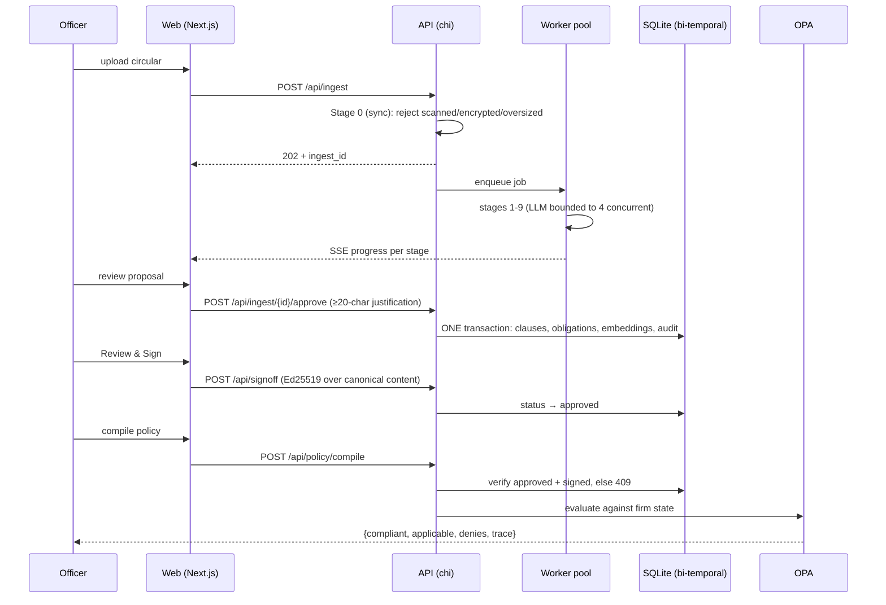
```mermaid
sequenceDiagram
    participant O as Officer
    participant W as Web (Next.js)
    participant A as API (chi)
    participant P as Worker pool
    participant D as SQLite (bi-temporal)
    participant E as OPA

    O->>W: upload circular
    W->>A: POST /api/ingest
    A->>A: Stage 0 (sync): reject scanned/encrypted/oversized
    A-->>W: 202 + ingest_id
    A->>P: enqueue job
    P->>P: stages 1-9 (LLM bounded to 4 concurrent)
    P-->>W: SSE progress per stage
    O->>W: review proposal
    W->>A: POST /api/ingest/{id}/approve (≥20-char justification)
    A->>D: ONE transaction: clauses, obligations, embeddings, audit
    O->>W: Review & Sign
    W->>A: POST /api/signoff (Ed25519 over canonical content)
    A->>D: status → approved
    O->>W: compile policy
    W->>A: POST /api/policy/compile
    A->>D: verify approved + signed, else 409
    A->>E: evaluate against firm state
    E-->>O: {compliant, applicable, denies, trace}
```

---

## The firm as data

Impact analysis that returns a count is not actionable. CHANAKYA models the firm itself: 15
bi-temporal tables seeded with a complete fictional adviser (Alpha Wealth Advisors, SEBI reg
`INA000000001`, Mumbai, inc. 2019): so `ImpactOf` returns **names**.

| Entity | Count |
|---|---|
| Clients | 140 |
| Employees | 24 |
| Departments | 8 |
| Documents | 22 |
| Registers | 7 |
| Systems | 7 |
| Risks | 14 |
| Communications | ~90 |

Two namespaces, one seam. The **regulatory** graph (external, regulator-authored, immutable) and the
**enterprise** graph (internal, firm-authored, mutable) stay separate. They join at `control` and at
`binds_to`: and `binds_to` carries a confidence score plus a `human_confirmed` flag, because a guess
about which internal policy governs a clause must never be indistinguishable from the clause itself.

### The deliberate gaps: every one discovered *by query*

None is recorded anywhere as a problem. Each is simply what a traversal returns.

| Gap | How it surfaces |
|---|---|
| **118 clients** still on the superseded agreement template | `client ⋈ agreement`, filtered to the in-force template |
| **3 employees** without current training | `training` rows in the latest period with no completion date |
| **1 adviser** serving both advisory and distribution clients | group `client` by adviser, count distinct service kinds |
| Complaint register **90 days stale** | register freshness |
| Cybersecurity policy **14 months** since review | document review recency |

The 22 re-papered clients hold **two** agreement rows: the original, closed in world time on the
re-papering date, and its replacement. Modelling it as a supersession rather than "these clients were
always on v2" is what makes the time-travel claim real: set the as-of date before the re-papering and
all 140 clients come back on v1.

> **Recency is stored as an offset, not a date.** "Reviewed 14 months ago" is the fact; the calendar
> date depends on when you look. With absolute dates baked in, every policy in the firm went overdue
> once a year passed, and the single deliberate annual-review breach was buried under 21 accidental
> ones.

---

## Repository structure

```
CHANAKYA/
├── docker-compose.yml            # backend + frontend, one command
├── dev.ps1                       # Windows: start both services locally
├── ARCHITECTURE.md               # durable design record, updated every phase
│
├── backend/                      # Go 1.26 · module `chanakya` · stateless HTTP
│   ├── cmd/
│   │   ├── api/                  #   main: config → store → serve (graceful shutdown)
│   │   ├── seed/ compile/ dump/  #   optional manual steps; api self-seeds on first run
│   ├── db/migrations/            #   12 embedded .sql, applied in-process on boot
│   └── internal/
│       ├── domain/               #   pure types; Obligation.Validate rejects missing provenance
│       ├── store/                #   bi-temporal SQLite, recursive CTEs, SupersedeAndInsert
│       ├── ingest/               #   10-stage pipeline (intake → ready_for_review)
│       ├── compiler/             #   schema.json + the verbatim-citation gate
│       ├── llm/                  #   Extractor: Gemini | Anthropic | offline (SelectExtractor)
│       ├── policy/               #   Rego compilation + embedded OPA evaluation
│       ├── signoff/              #   Ed25519 canonical signing + live verification
│       ├── workflow/             #   25-verb closed vocabulary → 8 reviewed templates
│       ├── enterprise/           #   projection + ImpactOf (returns names, not counts)
│       ├── connect/              #   15 connectors; interface has no write method
│       ├── feed/                 #   self-validating SupTech feed + schema.json
│       ├── jobs/                 #   worker pool; every stage runs under recover()
│       ├── vec/                  #   dependency-free embeddings + cosine similarity
│       ├── corpus/               #   regression tests over the demo narrative
│       ├── fixtures/             #   SEBI IA master circular + the seeded firm
│       └── httpapi/              #   chi router, middleware, ~40 handlers
│
├── frontend/                     # Turborepo · npm workspaces
│   ├── apps/web/                 #   Next.js 16 App Router: 12 screens
│   │   ├── app/                  #     / ingest review workflows evidence company
│   │   │                         #     register regulatory-feed amendments policy audit feed
│   │   ├── components/           #     app-shell · graphs · signoff-modal · as-of-provider
│   │   └── lib/api.ts            #     the single typed API client
│   └── packages/ui/              #   design tokens (globals.css) + shared primitives
│
├── testdata/                     # ~20-document corpus + manifest.json with expected gap values
├── scripts/capture_screenshots.py# renders every screenshot in this README from the live app
└── docs/
    ├── assets/banner.svg
    └── screenshots/              # the 13 captures used above
```

---

## Technology stack

| Layer | Technology |
|---|---|
| **Backend** | Go 1.26 · `go-chi/chi` v5 · `go-chi/httprate` · `go-chi/cors` |
| **Policy engine** | Open Policy Agent v1.18 (embedded `rego` + `topdown` tracer) |
| **Database** | SQLite via `modernc.org/sqlite` (pure Go, no cgo) · WAL · `foreign_keys=ON` |
| **PDF** | `pdfcpu` (encryption/page detection) · `rsc.io/pdf` (positioned text) · optional `pdftotext` |
| **Validation** | `santhosh-tekuri/jsonschema/v6`: same schema validates output *and* drives strict tool use |
| **Crypto** | `crypto/ed25519` (stdlib): canonical JSON, hash + signature over obligation content |
| **LLM** | Google Gemini · Anthropic Claude (strict tool use) · deterministic offline extractor |
| **Frontend** | Next.js 16 · React 19 · TypeScript 5 · Tailwind CSS v4 (CSS-first, no config file) |
| **UI** | Base UI (`@base-ui/react`) · Radix primitives · Lucide · Sonner |
| **State / data** | TanStack Query (+ persist client) · TanStack Table · `nuqs` |
| **Graphs / motion** | React Flow (`@xyflow/react`) · Dagre layout · Framer Motion |
| **Type** | Source Serif 4 (editorial) · Inter (interface) · JetBrains Mono (all data values) |
| **Tooling** | Turborepo · npm 11 workspaces · ESLint 9 · Prettier |
| **Container** | Docker Compose (backend + frontend) |

---

## Installation

Prerequisites: **Go 1.26+** and **Node 20+**. No database to install, no broker, no Docker required :
the backend creates `./chanakya.db` on first run.

```bash
git clone https://github.com/mridulbansal4/Chanakya.git
cd Chanakya
```

### Windows (recommended)

```powershell
.\dev.ps1
```

Starts the Go backend on `:8080` and the Next.js app on `:3000` in two child windows, refreshing PATH
from the registry first so a freshly-installed Go is picked up.

### Any platform, two commands

```bash
go run ./backend/cmd/api
```

```bash
cd frontend && npm install && npm run dev
```

The backend **self-seeds on first run**: `bootstrap.EnsureSeeded` loads the SEBI IA master-circular
fixture and compiles it with the offline extractor, so the app is fully populated with no manual seed
step. Open <http://localhost:3000>.

### Docker

```bash
docker compose up --build
```

### Environment

All configuration is environment-only: no secrets in code. Copy `.env.example` to `.env`:

| Variable | Effect |
|---|---|
| `GEMINI_API_KEY` | Selects the **Gemini** extractor (`GEMINI_MODEL` optional) |
| `CHANAKYA_LLM_API_KEY` | Selects the **Anthropic** extractor (`CHANAKYA_LLM_MODEL` optional) |
| *(neither set)* | Falls back to the **deterministic offline extractor**: fully functional, no API key |
| `CHANAKYA_SIGNING_KEY_B64` | Ed25519 seed; otherwise a gitignored key file is created on first run |
| `CHANAKYA_PDF_EXTRACTOR` | Opt in to `pdftotext -layout`; a missing binary is a clear error, never a silent fallback |
| `BACKEND_URL` · `PORT` | Used by the frontend, primarily inside Docker |

> **The offline extractor is not a stub.** It splits clauses into verbatim sentences, classifies the
> deontic modal with word-boundary matching (`must`/`shall` → MUST, `must not` → MUST_NOT: and
> critically *not* "must **not**ify"), extracts numeric thresholds and `within N days` deadlines, and
> scores confidence. Whichever extractor runs, its output is re-validated identically: the choice
> never weakens the safety model.

---

## Running

| Command | Purpose |
|---|---|
| `.\dev.ps1` | Windows: start backend + web together |
| `go run ./backend/cmd/api` | Backend on `:8080`; self-seeds an empty database |
| `npm run dev` *(in `frontend/`)* | Vite-fast Next dev server on `:3000` |
| `npm run build` / `typecheck` / `lint` | Turborepo tasks across the workspace |
| `go test ./backend/...` | Full backend suite |
| `go run ./backend/cmd/seed` | Manually reload the IA fixture |
| `go run ./backend/cmd/compile` | Manually re-run extraction + gap/ticket generation |
| `py scripts/capture_screenshots.py` | Re-render every screenshot in this README from the live app |

Health: `GET http://localhost:8080/health` → `{"status":"ok","checks":{"database":{"ok":true}}}`.

---

## API surface

~40 routes, all under `/api` (except `/health` and `/version`), rate-limited to **240 requests per
minute per IP** with `Retry-After` on 429. Every data endpoint accepts `?as_of=` (`YYYY-MM-DD` or
RFC3339; a bare date is end-of-day UTC) and returns a bi-temporal reconstruction.

| Endpoint | Returns |
|---|---|
| `GET /api/obligations` · `/obligation?id=` | The register; detail with clause text and citation |
| `GET /api/graph` · `/posture` · `/clauses` | Clause→obligation graph, status roll-up, clause picker |
| `POST /api/ingest` | `202` + `ingest_id`; Stage 0 runs synchronously |
| `GET /api/ingest/{id}/events` | **SSE** progress: exempt from the 30s router timeout |
| `GET /api/ingest/{id}/preview` | The proposal: obligations, rejections, amendment diff |
| `POST /api/ingest/{id}/approve` | **The graph gate.** One transaction. `409` if already settled |
| `POST /api/amendments/blast-radius` | Read-only what-if; nothing persisted |
| `GET /api/evidence` · `/tickets` | Coverage map (`read_only: true` on every source) + draft tickets |
| `GET /api/review-queue` · `GET/POST /api/signoff` | Queue; Ed25519 sign + live verification |
| `POST /api/policy/compile` | **409** unless approved *and* signed |
| `POST /api/policy/stage` · `/policy/evaluate` | `audit`/`soft`/`hard`; `blocked` only at `hard` |
| `GET /api/lineage` | The six-column audit chain as of a date |
| `GET /api/feed` · `/feed/schema` | SupTech feed (self-validating; `500` if invalid) + its schema |
| `GET /api/enterprise/summary` · `/enterprise/impact` | Firm posture; impact resolved to **names** |
| `GET /api/clients?impacted_by=` · `/documents?stale=true` | Affected populations, stale documents |
| `GET /api/workflows` · `/workflows/{id}/tasks` · `POST .../approve` | Draft DAGs; approval dispatches nothing |
| `GET /api/connectors` | 15 connectors, `read_only: true`, health per connector |

Obligation ids embed the circular id and contain `/`, so detail endpoints take a query parameter
rather than a path parameter.

---

## Feature matrix

| Capability | Where it lives |
|---|---|
| Regulation compiler (PDF → cited obligations) | `internal/ingest` + `internal/compiler` |
| Living bi-temporal obligation graph | `internal/store` (recursive CTEs, `SupersedeAndInsert`) |
| Amendment matching + blast radius | `internal/ingest/amendment.go`, `internal/vec`, `store.BlastRadius` |
| Evidence mapping + gap detection | `store.EvidenceMap` |
| Draft remediation tickets (never filed) | `store.GenerateDraftTickets` |
| HITL review queue + Ed25519 sign-off | `internal/signoff`, `/review` |
| Policy-as-code, staged enforcement | `internal/policy` (embedded OPA) |
| Workflow synthesis with named owners | `internal/workflow` |
| Enterprise projection + named impact | `internal/enterprise` |
| Read-only connector fabric (15) | `internal/connect` |
| Machine-readable regulator feed | `internal/feed` |
| Bi-temporal audit lineage | `store.Lineage`, `/audit` |

---

## Testing & adversarial guarantees

```bash
go test ./backend/...
```

All packages pass: `compiler`, `connect`, `corpus`, `domain`, `enterprise`, `feed`, `httpapi`,
`ingest`, `jobs`, `llm`, `policy`, `signoff`, `store`, `vec`, `workflow`.

The tests worth knowing about are the ones that exist to make a future change *fail*:

| Test | What it prevents |
|---|---|
| `TestConnectorInterfaceHasNoWriteMethod` | Adding any write-shaped method to `Connector` |
| `TestApproveWorkflowDispatchesNothing` | Approval silently moving tasks out of `draft` |
| `TestNoRegoInjectionViaThresholdMetric` / `...ViaSourceClauseRef` | Extracted text reaching the Rego compiler as executable syntax |
| `TestCurrentRowUniqueness` | Losing the "at most one current version" database guarantee |
| `TestRebuiltTablesKeepEveryColumn` | A migration silently dropping a column (this actually happened once: `obligation.embedding_json`) |
| `TestMITCIsRejectedAsScanned` | A scanned PDF slipping past Stage 0 |
| Corpus assertions in `internal/corpus` | The demo *narrative* drifting: if a fixture refactor turns the 118-client gap into 117, this fails while everything else still compiles |

**Prompt injection.** A document in the testing corpus carries an injection payload. Three independent
guards are asserted, and the finding is recorded honestly: the extractor **does quote the injected
sentence**, because it is genuinely present in the document. That is the citation gate *working* :
provenance points at real text, and the strict schema (`additionalProperties: false`) still refuses
the requested shape, and nothing arrives approved.

Signature tamper-detection is likewise pinned: mutating any of five material fields breaks
verification, while flipping `status` to `approved` does **not**: the signature covers content, and
status is deliberately excluded from the canonical form.

---

## Design system

The interface is called **Operational Ink**: an instrument, not a dashboard. Dark-first, hairline
borders, tabular monospace for every data value, and colour spent on exactly five jobs.

Tokens are the single source of truth in [`packages/ui/src/styles/globals.css`](frontend/packages/ui/src/styles/globals.css).
Components must not hardcode a hex value or a raw Tailwind palette class.

| Token group | Values |
|---|---|
| **Canvas (dark)** | `#08090a` sunken · `#0b0c0e` canvas · `#121317` raised · `#16181d` overlay |
| **Hairlines** | `#1c1f25` subtle · `#24282f` · `#333944` strong |
| **Foreground** | `#f2f4f7` (17.8:1) · `#a8b0bc` (8.9:1) · `#7b8494` (5.2:1) · `#5a6373` decorative only |
| **Accent** | `#4c82f7` on dark · `#1d4ed8` fill |
| **Status** | ok `#3fa97a` · warn `#e0a215` · risk `#e5484d`: desaturated on purpose |
| **Type** | Source Serif 4 (editorial) · Inter (UI) · JetBrains Mono (data) |

Every foreground step above `--fg-faint` is verified at ≥4.5:1. The canvas is near-neutral with a ~4°
cool cast: a tinted canvas reads as *tech product*, a neutral one reads as *instrument*. In an
instrument, alarm comes from contrast against a calm field, not from saturation.

Motion communicates causation (blast-radius propagation, layer by layer) never decoration. Sign-off
is a deliberate multi-step modal with a mandatory typed justification: **friction is a feature**.

---

## Roadmap

- **Live regulatory monitoring.** CHANAKYA does not poll SEBI today, and says so in the product.
  Connecting a real source means solving change detection and de-duplication before it means solving
  ingestion.
- **Postgres.** The store abstraction and parameterised SQL are already portable; the bi-temporal
  partial-unique-index trick needs revisiting under a real FK implementation.
- **Live connectors.** The 15 adapters run in `mode: mock` against seeded data. A configured live
  credential currently returns an **explicit error** rather than silently serving mock data as though
  it came from the firm's real systems: that behaviour should survive the transition.
- **Client-side signing keys.** The MVP holds the reviewer's Ed25519 key server-side; the verification
  model is identical to an HSM or browser-held key, so this is a key-custody change, not a redesign.
- **Depth in amendment matching.** Many-to-one currently takes the single best match with a
  deterministic tie-break, never a multi-way merge.

---

## Acknowledgements

- **SEBI**: the Investment Adviser regulations and master circulars the corpus is built from.
- **Open Policy Agent**: the deterministic engine that does all enforcement.
- **SEBI TechSprint**: Problem Statement 2.

---

## License

Released under the [MIT License](LICENSE) © 2026 MindstriX Technologies LLP.

<div align="center">
<br/>
<sub><b>CHANAKYA</b>: Regulatory Operating System · Nothing enforced that a human did not sign</sub>
</div>
