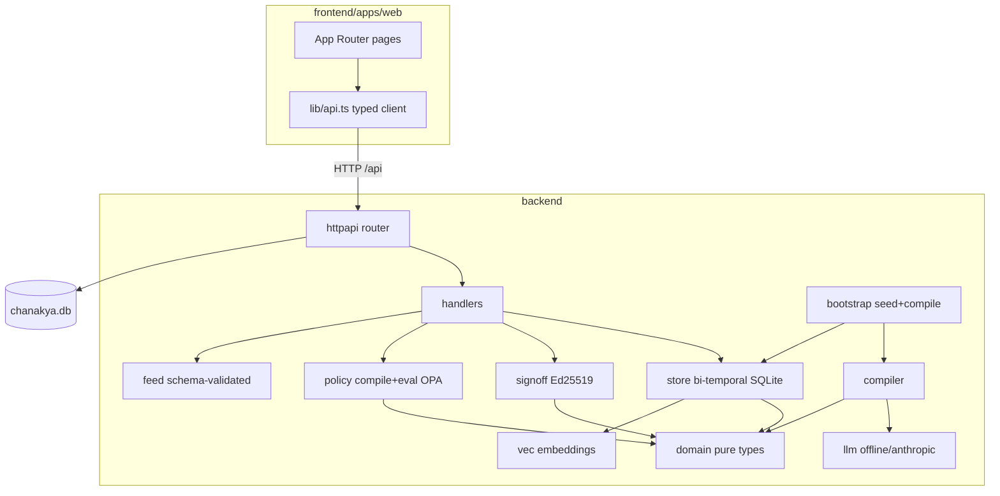

# CHANAKYA — Enterprise Codebase Audit

**Repository:** `C:\Projects\SEBI\CHANAKYA` (branch `master`)
**Scope:** 186 tracked files, ~9,500 LOC of first-party source (Go backend + Next.js frontend), excluding lock files.
**Audit type:** Read-only. No application code was modified. Three temporary Go probe tests were written, executed, and deleted; one isolated backend instance (separate DB, port 8099) was run and torn down. The working demo (`:8080` / `:3000`) and its `chanakya.db` were untouched.
**Method:** Every first-party Go and TypeScript source file was opened and read. Findings marked CONFIRMED were reproduced with executable probes; the headline finding was reproduced end-to-end over HTTP.

---

## 1. Executive Summary

CHANAKYA is a "regulatory operating system" built for the SEBI TechSprint (PS-2): it compiles SEBI circulars into a bi-temporal graph of typed, cited obligations, routes them through a cryptographic human sign-off, and compiles **signed** obligations into deterministic OPA/Rego policies that evaluate a firm's compliance. The engineering is, on the whole, unusually disciplined for a hackathon build: pure-Go SQLite with a clean migration runner, fully parameterized SQL (no injection in the data layer), a coherent bi-temporal model, schema-validated LLM extraction with mandatory verbatim citations, and green `go vet` / `go test` / `tsc`.

The system's **entire safety thesis is "a human signs, then a deterministic engine enforces."** The audit found one defect that breaks exactly that thesis and one architectural gap that makes it moot:

1. **CRITICAL — Rego injection in the policy compiler.** Obligation fields (`threshold.metric`, `source_clause_ref`, `deontic_type`) are string-interpolated straight into generated Rego source. A crafted `threshold` makes the compiled policy report a **non-compliant firm as compliant** — the enforcement engine lies. Reproduced end-to-end over the HTTP API. This is the worst possible failure for a compliance tool: silent, wrong "green."
2. **HIGH — No authentication or authorization anywhere.** Every state-changing endpoint — including `POST /api/signoff`, the "only path that can move an obligation to approved," and `POST /api/policy/stage`, which promotes a policy to blocking `hard` enforcement — is fully open. `signed_by` is free text. Anyone who can reach the port can forge a compliance officer's cryptographic sign-off. This is also the delivery vector for #1.
3. **HIGH (same root cause as #1) — Persistent enforcement DoS.** A malformed injection payload compiles but won't parse at eval time, permanently `500`-ing evaluation for that obligation.

**Biggest structural risk:** the sign-off is presented (in UI, schema comments, and the regulator feed) as a trustworthy cryptographic attestation by a named human, but nothing authenticates the human and the thing being signed can be manipulated into a policy that misreports compliance. For a demo this is fine; before this is anything a regulator relies on, #1 and #2 are blockers.

**Overall health: 72/100** — high craft, strong data-layer discipline, but a critical enforcement-integrity bug and a total absence of an auth layer pull it down. Both are fixable in well under a day.

---

## 2. Architecture Overview

### What it is
A **monorepo** with two independent stacks joined only by an HTTP contract:

- **Backend** — Go 1.26 module `chanakya` (`backend/`), a `chi` REST API over a pure-Go (`modernc.org/sqlite`) SQLite file in WAL mode. Layered `domain → store → {compiler, policy, signoff, feed, vec} → httpapi`. Self-seeds and self-compiles a SEBI Investment Advisers Master Circular fixture on first run.
- **Frontend** — Turborepo (`frontend/`) with a Next.js 16 App-Router web app (`apps/web`), a shared `@workspace/ui` package (Tailwind v4, Base UI), React 19, TanStack Query. Talks to the backend via a fully-typed client (`lib/api.ts`). No secrets; the only browser-exposed config is `NEXT_PUBLIC_API_BASE_URL`.

### Primary request path (verified, with citations)
`POST /api/signoff` (approve):
`httpapi.NewRouter` → chi middleware (RequestID, RealIP, Logger, Recoverer, CleanPath, 30s Timeout, CORS, per-IP rate-limit 240/min) [`httpapi.go:74-99`] → `handlers.postSignoff` [`signoff.go:55`] → validate action / `signed_by` / justification≥20 chars [`signoff.go:67-83`] → optional `ApplyObligationCorrection` [`store/graph.go:71`] → `signer.Sign` (Ed25519 over canonical content) [`signoff/signoff.go:93`] → `store.UpsertSignoff` + `SetObligationStatus(approved)` [`store/signoff.go:113`, `:43`] → JSON response. All SQL parameterized.

### Module diagram



### Conventions in force (the baseline later phases judge against)
Errors wrapped with `fmt.Errorf("...: %w")` at every layer; SQL exclusively `?`-parameterized; bi-temporal `(valid_from/valid_to, tx_from/tx_to)` on every graph table with the "as-of" predicate repeated verbatim; deterministic surrogate IDs for idempotent seeding; RFC3339-UTC strings so lexical = chronological comparison; frontend uses typed API models (no `any`), TanStack Query for all fetches, design tokens via `@workspace/ui`.

**No findings reported in Phase 0.**

---

## 3. Critical Issues

### C-1 — Rego injection: compiled policy misreports compliance (obligation fields interpolated into policy source)
- **File:** `backend/internal/policy/compile.go:73-107` (all `fmt.Fprintf` sites), esp. `:85-88` (`th.Metric`), `:87` / `:122` (`ref` = `SourceClauseRef`), `:74` (`o.DeonticType`)
- **Category:** Injection / enforcement-integrity (OWASP A03)
- **Verdict:** **CONFIRMED** (reproduced end-to-end over HTTP)
- **Severity:** CRITICAL · **Confidence:** CONFIRMED · **Effort:** S (<2h)
- **STATUS: ✅ REMEDIATED.** `compile.go` was rewritten so every obligation-derived value is emitted as a JSON-encoded Rego string literal (`regoString`) or a sanitized single-line comment (`regoComment`) — no field is ever interpolated into Rego code structure; message text is built from `sprintf` arguments, not a format string. The exact end-to-end exploit was re-run against a fresh instance and the non-compliant firm (retention=1 vs ≥5) now correctly reports `compliant=false`. Regression test: `policy/injection_test.go::TestNoRegoInjectionViaThresholdMetric`.

`Compile` builds the Rego module by directly interpolating obligation string fields into source with `fmt.Fprintf`. None are escaped for the Rego string-literal context. The `metric` value comes from `threshold_json`, which an unauthenticated caller can set via a sign-off correction (`ObligationCorrection.Threshold`, `store/graph.go:90-94`) — and which, in the LLM path, comes straight from model output validated only as `type:string`.

**Reproduced attack (isolated instance, no auth):** a `threshold.metric` carrying newlines closes the generated `compliant`/`deny` rules and appends `compliant if { true }`. Full chain over HTTP:

```
POST /api/signoff   {action:"approve", signed_by:"attacker", justification:"…20+ chars…",
                     corrections:{threshold:{metric:"<payload>", operator:">=", value:5, kind:"requirement"}}}
POST /api/policy/compile   {obligation_id:"…"}
POST /api/policy/evaluate  {obligation_id:"…", input:{metrics:{retention_period:1}}}
→ RESULT compliant=true applicable=true denies=[]
```

Ground truth: `retention_period = 1` against a `>= 5` requirement is **non-compliant**. The engine returned **compliant, no denials**. The generated module (captured during the probe) contained the injected `compliant if { true }` rule verbatim.

- **Failure scenario:** a firm (or an attacker acting against a firm's record) causes the deterministic "enforcement" engine — the component the whole product markets as the trustworthy half — to certify a breach as compliant, silently. In a regulatory context this is the highest-consequence outcome possible.
- **Why it's a problem:** the enforcement engine is supposed to be the *incorruptible* half of "human signs, machine enforces." Injection makes it corruptible by its own input data.
- **Recommended fix:** stop generating Rego by string interpolation of data. Two options, in order of preference:
  1. **Ship a single static, reviewed Rego module** parameterized entirely by `input` (pass `metric`, `operator`, `value`, `kind`, `obligation_id`, `deontic` as *data* in `input`, not as code). The policy logic is identical for every obligation; only the data differs. This removes the injection class entirely.
  2. If per-obligation modules are kept, **whitelist** `metric` against a known set, constrain `operator` to the 5 valid symbols (already done for the symbol, but the raw `metric`/`ref` still flow in), and reject any obligation field containing characters outside `[A-Za-z0-9_ .-]` **before** compile — plus keep the schema's `threshold.metric` to an enum.
- **Also fix the delivery vector** (see H-1): even with escaping, an unauthenticated approve+correct call shouldn't exist.

---

## 4. High Priority Issues

### H-1 — No authentication or authorization on any endpoint, including the cryptographic sign-off
- **File:** `backend/internal/httpapi/httpapi.go:74-123` (router: only RequestID/RealIP/Logger/Recoverer/CleanPath/Timeout/CORS/rate-limit — no auth middleware); `signoff.go:55` (`postSignoff`); `policy.go:134` (`setPolicyStage` → `hard`)
- **Category:** Broken access control (OWASP A01) · **Severity:** HIGH · **Confidence:** CONFIRMED · **Effort:** M (<1d)
- **Failure scenario:** `POST /api/signoff` is documented in code as *"the ONLY path that can move an obligation to approved"* (`signoff.go:52-54`) and produces an Ed25519 signature attributed to a **free-text `signed_by`** the caller supplies. Any client that can reach the port can (a) forge an approving sign-off as "Priya Menon (CCO)", (b) promote any policy to `hard` (blocking) enforcement via `policy/stage`, and (c) deliver C-1. The regulator feed (`store/feed.go:118-123`) then republishes the forged sign-off as provenance.
- **Why it's a problem:** the product's core claim is *human accountability via cryptographic sign-off*. With no authentication, the signature attests to nothing — anyone can produce one under any name. The server-held signing key is an acknowledged MVP simplification (`signoff/signoff.go:6-9`), but the **absence of any caller authentication** is a separate, larger gap and is not acknowledged.
- **Recommended fix:** put an authentication gate in front of `/api` writes (session or bearer token → an identity), derive `signed_by` from the authenticated principal rather than the request body, and gate `policy/stage`→`hard` and `signoff` behind an authorization check for a "compliance officer" role. For the demo, even a single shared bearer token + binding `signed_by` to it would close the forgery.

### H-2 — Persistent enforcement denial-of-service via the same injection
- **File:** `backend/internal/policy/compile.go` (generation) → `policy/eval.go:24-31` (`PrepareForEval` parse) → `httpapi/policy.go:200-204`
- **Category:** Availability / injection (OWASP A03/A06) · **Severity:** HIGH · **Confidence:** CONFIRMED · **Effort:** S (resolved by C-1's fix)
- **STATUS: ✅ REMEDIATED.** `Compile` now calls `validatePrepares(module)` (a full OPA parse+prepare, identical to the evaluator's) before returning, so a module that would fail at eval time is rejected at compile time and never persisted. Regression test: `policy/injection_test.go::TestCompileNeverReturnsUnparseableModule`.
- **Failure scenario:** a `threshold.metric` / `source_clause_ref` payload that injects **syntactically invalid** Rego (e.g. an unbalanced brace, or a raw newline in `source_clause_ref` — reproduced: `3.1\ninjected := 42\n#` breaks `package` parsing) still **compiles and persists** (compile only builds a string), but every subsequent `POST /api/policy/evaluate` for that obligation returns `500 "failed to evaluate policy"` because OPA rejects the module. The obligation's enforcement is permanently bricked until a human rewrites the stored policy. `compilePolicy` does not attempt a parse before storing, so the bad module is accepted silently.
- **Recommended fix:** subsumed by C-1 (no data in code). Independently: **validate the generated module parses** (`rego.New(...).PrepareForEval`) inside `compilePolicy` before `UpsertPolicy`, and return `400`/`422` if it doesn't.

---

## 5. Medium Priority Issues

### M-1 — Business constant hardcoded in firm-state builder
- **File:** `backend/internal/store/policy.go:218` — `metrics["retention_period"] = 5`
- **Category:** Business constant · **Severity:** MEDIUM · **Confidence:** CONFIRMED · **Effort:** XS
- The firm's actual record-retention period is hardcoded to `5` in the *suggested evaluation input*, with a comment inviting the user to edit it in the UI. For a demo this is a seeded default, but it is a domain value living in code with no constant/config home, and it silently makes the retention requirement policy pass by default. Move to the entity `meta_json` (where `clients` and `annual_fees_inr` already live) so firm state has a single source.

### M-2 — Hidden metric-key remapping couples two layers by string literal
- **File:** `backend/internal/store/policy.go:210-214` — remaps `annual_fees_inr` (entity meta) → `annual_fees` (policy input key)
- **Category:** Duplication / hidden coupling · **Severity:** MEDIUM · **Confidence:** CONFIRMED · **Effort:** S
- The policy compiler gates on `input.metrics["annual_fees"]` (via the offline extractor's threshold, `llm/offline.go:174`) while the entity stores `annual_fees_inr`. The bridge is a literal string remap in `FirmState`. If either literal changes, the fee policy silently never applies (evaluates as "not applicable → compliant"). Define the metric keys as shared named constants used by both the extractor's threshold builder and the firm-state builder.

### M-3 — `as_of` date interpreted as end-of-day UTC — timezone edge cases
- **File:** `backend/internal/httpapi/obligations.go:28-30` (`d.UTC().Add(24h - 1s)`)
- **Category:** Correctness · **Severity:** MEDIUM · **Confidence:** LIKELY (unverified: no test exercises an IST day boundary) · **Effort:** S
- A bare `YYYY-MM-DD` is treated as `23:59:59Z`. For a firm operating in IST (UTC+5:30), obligations issued/valid around a day boundary can fall on the "wrong" side of an as-of query by up to 5.5 hours. Given the product's core promise is precise "as-of any date" reconstruction, the timezone convention should be explicit and tested.

### M-4 — Security-sensitive HTTP layer has zero tests
- **File:** `backend/internal/httpapi/` (no `_test.go` files; confirmed via `go test` output "[no test files]")
- **Category:** Test coverage · **Severity:** MEDIUM · **Confidence:** CONFIRMED · **Effort:** M
- Every other backend package has tests (all green). The `httpapi` package — which contains the sign-off gate, the policy-stage promotion, the JSON body validation, and the reachable path for C-1/H-1/H-2 — has none. The critical bug lives precisely in the untested layer. Add handler tests covering: sign-off validation, the approve→compile→evaluate chain, and (as a regression guard for C-1) a malicious-threshold rejection.

---

## 6. Low Priority Issues

- **L-1 — Dead code in DSN builder.** `backend/internal/store/store.go:76-78`: `q := url.Values{}` immediately followed by `_ = q` (with an explanatory comment). Leftover; delete both lines. Severity LOW, CONFIRMED, XS.
- **L-2 — 33 ESLint warnings (0 errors).** `npm run lint` reports `react-hooks/set-state-in-effect` (e.g. `screen-banner.tsx:17`, `policy/page.tsx` firm-state init, `signoff-modal`) and `react-hooks/immutability` (`overview-graph.tsx:182`). None break the build; they flag effect-driven `setState` cascades worth cleaning. Severity LOW, CONFIRMED, S.
- **L-3 — Residual npm advisories with no non-breaking fix.** After bumping `next` to 16.2.12, 9 HIGH advisories remain: `brace-expansion`/`minimatch` (dev-only, transitive under ESLint) and `postcss`/`sharp` (bundled inside `next`, flagged across all 16.x). `npm audit fix --force` would downgrade `next` to 9.x and break the app. Not runtime-reachable in a meaningful way for this app; wait for upstream. Severity LOW, CONFIRMED.
- **L-4 — Magic numbers without named homes.** Rate limit `240/min` (`httpapi.go:99`), body cap `1<<20` repeated in 3 handlers, `minJustificationLen=20` (backend const) vs `MIN_JUSTIFICATION=20` (frontend const) duplicated across the boundary. Mostly already named constants; the 20-char rule living independently on both sides is the one worth centralizing (or at least documenting as a shared contract). Severity LOW.

---

## 7. Technical Debt Register

| Item | Ongoing cost |
|---|---|
| Per-obligation Rego generated by string interpolation (C-1) | Every new obligation field added to the template is a new injection surface; the template is hard to test and review. |
| No auth layer (H-1) | Blocks any real deployment; every "who did this" answer is unauthenticated free text; retrofitting auth touches every write handler. |
| Metric keys coupled by string literals across extractor ↔ firm-state ↔ compiler (M-1/M-2) | Silent policy "not applicable" if any literal drifts; hard to notice because it fails *open* (compliant). |
| `httpapi` untested (M-4) | The highest-risk layer changes without a safety net. |

---

## 8. Refactoring Opportunities

- **Policy compilation: data-driven, not code-generated.** Current: one bespoke Rego module per obligation, built by `fmt.Fprintf`. Target: one static, reviewed, unit-tested Rego module; obligations become `input` data. Payoff: eliminates C-1 and H-2 entirely, makes policy behavior testable in one place, shrinks `compile.go` to a threshold-normalizer. Effort: S–M. Blast radius: `policy/`, one migration to recompile stored policies, `firm-state` shape.
- **Shared metric-key constants** used by `llm/offline.go`, `store/policy.go`, and `policy/compile.go`. Payoff: removes the fail-open coupling (M-2). Effort: S.

---

## 9. Performance Opportunities

The app runs against a single-writer SQLite with a tiny seeded corpus; nothing here is a real bottleneck at demo scale, but for correctness-of-pattern:

- **`PostureAsOf` runs the full `EvidenceMap` as a sub-computation** (`store/queries.go:202`) — evidence mapping issues ~4 queries; posture is fetched on every screen. Suspected N+1-ish amplification if the corpus grows; measure before optimizing. LIKELY, not measured.
- **`BlastRadius` loads every obligation and its embedding, then cosine-diffs in Go** (`store/blast.go:96-126`) — O(n·Dim) per amendment preview. Fine at n≈10; would need an ANN index at scale. Documented as intentional (`vec/vec.go:2-8`). INFO.
- **`SetMaxOpenConns(1)`** (`store/store.go:50`) serializes all DB access. Correct for SQLite-WAL single-writer, but it means the API is effectively single-threaded at the DB. Acceptable and deliberate. INFO.
- No frontend bundle analysis was run (no analyzer configured). Coverage gap, not a finding.

---

## 10. Security Risk Register (OWASP mapping)

| OWASP 2021 | Applies | State | Finding |
|---|---|---|---|
| A01 Broken Access Control | Yes | **Absent** | H-1 (no authn/authz on any write, incl. sign-off + policy-stage) |
| A02 Cryptographic Failures | Yes | Partial | Ed25519 sign-off is sound crypto (`crypto/ed25519`, `crypto/rand`, canonical serialization); but server-held key + no caller auth (H-1) means it authenticates nothing. |
| A03 Injection | Yes | **Vulnerable** | C-1 (Rego injection → compliance tamper), H-2 (Rego injection → DoS). **Data-layer SQL is clean** — all parameterized. No XSS sinks (`dangerouslySetInnerHTML`/`innerHTML`/`eval` — grep clean). |
| A04 Insecure Design | Yes | Partial | The "human sign-off" trust model is undermined by H-1 + C-1. |
| A05 Security Misconfiguration | Yes | OK-ish | CORS origins from env (`httpapi.go:83`), `AllowCredentials:false`, body caps + `DisallowUnknownFields` on JSON, 30s timeout, per-IP rate limit. Reasonable. No verbose stack traces leaked (generic error envelopes). |
| A06 Vulnerable Components | Yes | Low | L-3 (residual npm advisories, no non-breaking fix; Go deps current). |
| A07 Auth Failures | Yes | **Absent** | Subsumed by H-1. |
| A08 Data Integrity | Yes | Partial | Sign-off signs *content* not *status* — a genuinely nice design (tamper of any material field breaks the signature, verified in `signoff/signoff.go:106-126` + its tests). Undercut by C-1 acting downstream of signing. |
| A09 Logging | Yes | OK | Request logging via chi; no secrets logged; no PII in logs observed. No audit log of *who* changed enforcement stage (ties to H-1). |
| A10 SSRF | Partial | OK | Only outbound call is to `api.anthropic.com` with a fixed URL (`llm/anthropic.go:52`). The embedded OPA build did **not** expose `http.send` in the probe (evaluated to "no result", not a network call), so Rego injection does **not** escalate to SSRF. Verified. |

**Secrets:** none in code or git history. `chanakya_signing.key` and `chanakya.db` are gitignored and confirmed **never committed** (`git log --all` empty for both). `.env.example` files contain only documented non-secret defaults. LLM key is env-only (`config.go`, `cmd/compile/main.go:68`). Clean.

---

## 11. Hardcoded Values Report

| Category | Count | Highest severity |
|---|---|---|
| Secret | 0 | — |
| Environment | 0 real (all via `config.go` / `NEXT_PUBLIC_*` with documented defaults) | — |
| Business constant | 2 (M-1 retention=5, M-2 metric-key remap) | MEDIUM |
| Duplication | 1 (20-char justification rule on both sides, L-4) | LOW |
| Design token | 0 (colors/spacing centralized in `@workspace/ui` tokens; grep found no raw hex in components) | — |

Detail blocks for the business-constant findings are M-1 and M-2 above. **No hardcoded secrets, credentials, URLs-as-config, IPs, or absolute paths in first-party source.** The one absolute path is a PATH-refresh idiom in `dev.ps1` (Windows registry read), which is correct.

**INFO — realistic-looking synthetic PII in committed demo data.** `backend/internal/fixtures/ia_master_circular.json:13` has a fake PAN `AAECA1234F`; `Documents/Client_Register.csv` contains synthetic Indian names + fake PANs (e.g. `Rahul Sharma, ABCDE1234F`). These are generated demo records (`scripts/generate_documents.py`), not real PII, but they are indistinguishable from real at a glance — worth a header note in the file if the repo is ever public.

---

## 12. Dead Code Report

Verified by repo-wide reference search; the codebase is remarkably tight (many `.gitkeep` placeholders, no orphaned modules):

- **`store/store.go:76-78`** — `url.Values{}` allocated then discarded (`_ = q`). Safe to delete (L-1).
- **`frontend/apps/web/app/ui-demo/page.tsx`** — a component gallery/demo route with no inbound links from the app shell. Not dead (it's a reachable route) but appears to be a dev-only showcase; confirm intent before shipping to a regulator-facing build.
- No unused exports, unreachable functions, or commented-out code blocks found in first-party source. No `TODO`/`FIXME`/`HACK`/`console.log` in source (grep clean; the one hit was inside `package-lock.json`).

---

## 13. Dependency Report

- **Go (`backend/go.mod`):** current, well-chosen — `chi/v5`, `chi/cors`, `chi/httprate`, `open-policy-agent/opa v1.18.2`, `santhosh-tekuri/jsonschema/v6`, `modernc.org/sqlite` (pure Go, deliberately not cgo `mattn/go-sqlite3`). No known-vulnerable versions observed. `go.work.sum` is untracked (minor: commit it or ignore it explicitly).
- **npm (`frontend`):** `next` bumped 16.2.6 → **16.2.12** during this session (security patch). 9 residual HIGH advisories with **no non-breaking fix** (L-3): dev-only `brace-expansion`/`minimatch` under ESLint, and `postcss`/`sharp` bundled inside `next` (flagged across all 16.x). Forcing a fix downgrades `next` to 9.x and breaks the app — do not. No unused top-level deps observed; `framer-motion`, `@xyflow/react`, `@dagrejs/dagre`, TanStack query/table all used.
- **Duplicate/heavy:** none notable at first-party level.

---

## 14. Folder-by-Folder Findings

| Directory | Purpose | Health | Issues |
|---|---|---|---|
| `backend/cmd/{api,seed,compile}` | Entrypoints | Good | — |
| `backend/db/migrations` | 6 ordered SQL migrations, embedded | Good | Forward-only (no down-migrations); acceptable for SQLite-embed. |
| `backend/internal/domain` | Pure types + invariants | Excellent | Tested; mandatory-provenance invariant enforced. |
| `backend/internal/store` | Bi-temporal SQLite, parameterized SQL | Good | L-1 dead code; M-1/M-2 business constants. |
| `backend/internal/compiler` | Schema-validated extraction + verbatim citation | Excellent | Strong safety design; tested. |
| `backend/internal/policy` | **Rego compile + OPA eval** | **Vulnerable** | **C-1, H-2** live here. |
| `backend/internal/signoff` | Ed25519 canonical signing | Good | Sound crypto; undercut by H-1 upstream. |
| `backend/internal/{feed,vec,llm,fixtures,bootstrap,config}` | Feed schema, embeddings, extractors, seed, env config | Good | — |
| `backend/internal/httpapi` | REST handlers, middleware | **Gap** | **H-1** (no auth), **M-4** (no tests); reachable path for C-1. |
| `frontend/apps/web` | Next.js app, 11 screens, typed client | Good | L-2 lint warnings; `ui-demo` route. |
| `frontend/packages/{ui,eslint-config,typescript-config}` | Shared design system + configs | Good | — |
| `Documents/`, `docs/`, `scripts/` | Generated demo PDFs/CSV, screenshots, Python generators | OK | INFO: synthetic PII (§11). |

---

## 15. File-by-File Findings (files with findings)

| File | LOC | C/H/M/L | Assessment |
|---|---|---|---|
| `backend/internal/policy/compile.go` | 125 | 1/1/0/0 | Rego string-interpolation → injection (C-1, H-2). |
| `backend/internal/httpapi/httpapi.go` | 155 | 0/1/0/0 | Router defines no auth middleware (H-1). |
| `backend/internal/httpapi/signoff.go` | 209 | 0/1/0/0 | `postSignoff` unauthenticated; `signed_by` free text (H-1). |
| `backend/internal/httpapi/policy.go` | 219 | 0/0/0/0† | Enforces "approved + signoff" gate correctly; †reachable path for C-1 via unauth. |
| `backend/internal/store/policy.go` | 239 | 0/0/2/0 | M-1 retention=5, M-2 metric remap. |
| `backend/internal/httpapi/obligations.go` | 139 | 0/0/1/0 | M-3 as-of end-of-day UTC. |
| `backend/internal/store/store.go` | 203 | 0/0/0/1 | L-1 dead `url.Values`. |
| `frontend/apps/web/components/screen-banner.tsx` | 34 | 0/0/0/1 | L-2 setState-in-effect. |
| `frontend/apps/web/app/policy/page.tsx` | 525 | 0/0/0/1 | L-2; free-form firm-state JSON (by design). |
| `frontend/apps/web/components/overview-graph.tsx` | 195 | 0/0/0/1 | L-2 immutability warning. |

**Clean bill (representative):** all `domain/*`, `signoff/*`, `feed/*`, `vec/*`, `compiler/*`, `llm/*`, `fixtures/*`, `bootstrap/*`, `config/*`, all migrations, `lib/api.ts`, and the shared `packages/ui` — read, no findings.

---

## 16. Project Health Score

**Overall: 72 / 100.**

| Dimension | Score | Rubric / justification |
|---|---|---|
| Security | 45 | One CRITICAL enforcement-integrity injection + no auth layer. Offset by clean SQL, no XSS, no secrets, sound crypto primitives, no SSRF escalation. |
| Architecture | 85 | Clean layering, coherent bi-temporal model, good boundaries; the one architectural miss is code-generated policy + missing auth seam. |
| Code Quality | 88 | Disciplined error wrapping, near-zero dead code, no TODOs/debug cruft, consistent idioms; green vet/typecheck. |
| Performance | 78 | Correct-by-scale; deliberate single-writer SQLite; a couple of unmeasured amplification patterns. |
| Testing | 62 | Every domain/logic package tested and green; but the HTTP/security layer is entirely untested. |
| DevOps | 55 | No CI/CD, no containers, no monitoring — intentional for a hackathon MVP, but zero deployment hardening. |
| Dependencies | 80 | Current, well-chosen; residual npm advisories are upstream-blocked, not neglect. |
| Documentation | 90 | Exceptional in-code and `description/` docs; safety model spelled out; DEMO/ARCHITECTURE thorough. |

The score reflects a genuinely well-built system with one bug that happens to strike its single most important guarantee. Fix C-1 + H-1 and this moves to the high 80s.

---

## 17. Effort Estimates

| ID | Severity | Effort | Hours |
|---|---|---|---|
| C-1 | CRITICAL | S | 2–6 (static parameterized Rego module) |
| H-1 | HIGH | M | 4–8 (auth gate + bind `signed_by`) |
| H-2 | HIGH | S | resolved by C-1 (+1h for a parse-guard) |
| M-1 | MEDIUM | XS | <0.5 |
| M-2 | MEDIUM | S | 1–2 |
| M-3 | MEDIUM | S | 1–2 (+timezone test) |
| M-4 | MEDIUM | M | 4–8 (handler test suite) |
| L-1..L-4 | LOW | XS–S | ~3 total |
| **Total** | | | **~1.5–3.5 engineer-days** |

---

## 18. Recommended Fix Order (waves)

**Wave 1 — enforcement integrity (do first; small, high-impact).**
1. **C-1** — replace code-generated Rego with a single static module parameterized by `input`. This alone also closes **H-2**.
2. Add the **M-4** regression test that a malicious `threshold.metric` cannot alter a compliance verdict (guards C-1 from regressing).

**Wave 2 — access control (depends on nothing, but larger).**
3. **H-1** — auth gate on `/api` writes; derive `signed_by` from the authenticated principal; role-check `policy/stage`→`hard`.

**Wave 3 — correctness & coupling.**
4. **M-1, M-2** — shared metric-key constants; move retention default into entity meta.
5. **M-3** — make the as-of timezone convention explicit + tested.

**Wave 4 — cleanup.**
6. **L-1** (delete dead code), **L-2** (lint warnings), **L-4** (centralize the 20-char rule), commit or ignore `go.work.sum`.

Rationale: C-1/H-2 are the product-defining risk and cheapest to fix, so they lead. H-1 is larger and independent. Everything else is non-blocking hygiene.

---

## 19. Quick Wins (≤2h, low risk, ranked)

1. **M-1** — move `retention_period=5` out of code (XS).
2. **L-1** — delete the dead `url.Values` block (XS).
3. **H-2 parse-guard** — validate the generated module parses before `UpsertPolicy` (XS–S), a cheap stopgap even before the full C-1 refactor.
4. **M-2** — shared metric-key constants (S).
5. **L-4** — single source for the 20-char justification contract (S).

---

## 20. Long-Term Improvements

- **Data-driven policy engine** (retires the entire Rego-injection class and makes enforcement logic testable in one reviewed place).
- **Real identity + client-side signing** — the code already anticipates this (`signoff/signoff.go:6-9`); moving the signing key to the reviewer's client/HSM and authenticating callers makes the cryptographic sign-off mean what the UI says it means.
- **Handler/integration test tier + CI** — lock in the security-sensitive layer and run `go test` + `npm run typecheck/lint` + `npm audit` on every PR.
- **Audit log of enforcement changes** — record who staged a policy to `hard` and who signed, tied to authenticated identity.

---

## 21. Coverage Gaps and Unverified Observations

**Coverage: 100% of first-party source files (186 tracked; all Go + TS/TSX opened and read). Lock files (`package-lock.json` ×2, `go.sum`) were scanned, not line-read. Binary/asset files (PDFs, PNGs, `.ico`, `.svg`) were not opened. `node_modules` excluded by design.**

- **CONFIRMED items** (C-1, H-1, H-2, M-1, M-2, M-4, L-1, L-2, L-3, SSRF-non-escalation) were reproduced or directly observed in code/tooling output.
- **Unverified / lower confidence:**
  - **M-3** (timezone edge case) is reasoned from the code but no probe was run against an IST day boundary.
  - **Performance amplification** (§9) is suspected from reading, not measured — no load test or bundle analysis was run.
  - The **real Anthropic extraction path** (`llm/anthropic.go`) was read but not executed (no API key); its output still flows through the same schema + citation validation, and its `threshold.metric` is a live secondary source for C-1 (the schema constrains `metric` only to `type:string`).
- **Needs a human with product context:** whether `ui-demo` should ship; whether the synthetic PII in `Documents/` is acceptable for the repo's distribution; whether forward-only migrations are a deliberate constraint.
- **A hostile reviewer would still check:** rate-limit bypass via `X-Forwarded-For` spoofing of `RealIP` (the limiter keys on RealIP, which trusts the header — worth a look if the API is ever internet-facing behind a proxy that doesn't strip it), and whether `condition`/`penalty` fields reach any other code-generation sink (they do not, in current code).

---

*End of report. No application code was modified during this audit.*
