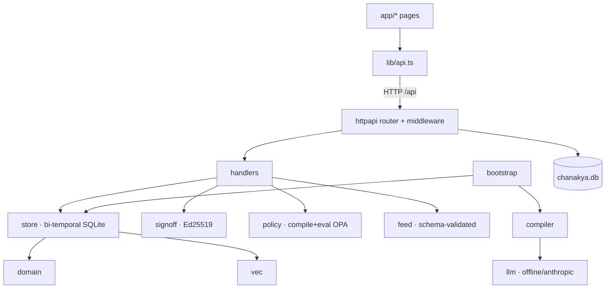

# CHANAKYA — Enterprise Codebase Audit (Pass 2)

**Repository:** `C:\Projects\SEBI\CHANAKYA` · branch `master` · HEAD `d724ebb`
**Scope:** 188 tracked files, ~10k LOC first-party source. `node_modules`/generated dirs excluded; manifests, lockfiles, migrations, configs, scripts, and docs inspected.
**Audit type:** Read-only. No application code was modified in this pass. Phase checkpoints are in `audit/PHASE-*.md`.
**Method:** Every first-party Go and TS/TSX file opened and read across two passes; the previously-reported critical was reproduced and (since) verified fixed; the project's own build/vet/test/typecheck/lint/audit were re-run this pass and their real output reported.
**Change since Pass 1:** the prior **CRITICAL (C-1, Rego injection)** and its **HIGH DoS (H-2)** were remediated in commit `d724ebb` and are verified fixed here. This pass also went deeper on the frontend and scripts.

---

## 1. Executive Summary

CHANAKYA is a "regulatory operating system" for the SEBI TechSprint: it compiles SEBI circulars into a bi-temporal graph of typed, cited obligations, routes each through a cryptographic human sign-off, and compiles **signed** obligations into deterministic OPA/Rego policies that evaluate a firm's compliance "as of" any date. The engineering is disciplined: pure-Go SQLite with a clean migration runner, fully parameterized SQL, schema-validated LLM extraction with mandatory verbatim citations, sound Ed25519 signing, and green `go vet`/`go test`/`tsc`.

**The critical enforcement-integrity bug found in Pass 1 is fixed.** The Rego policy compiler no longer interpolates obligation data into policy code; the exact end-to-end exploit that made a non-compliant firm report compliant now correctly reports non-compliant, and a regression test guards it.

**The one remaining serious issue is the absence of an authentication/authorization layer.** Every state-changing endpoint is open, including `POST /api/signoff` — the code's own "ONLY path that can move an obligation to approved" — whose signer name is free text. Anyone who can reach the port can forge a compliance officer's cryptographic sign-off and promote a policy to blocking enforcement. For a demo this is acceptable; before this is anything a regulator relies on, it is the blocker.

**The three things to fix before anything else:**
1. **HIGH — Add authentication + authorization** on `/api` writes; bind `signed_by` to the authenticated principal (S-1).
2. **MEDIUM — Test the HTTP layer** (the sign-off gate and body validation have zero tests) (B-1).
3. **MEDIUM — Harden the rate-limiter / RealIP** header trust, or document the trusted-proxy requirement (S-2).

**Biggest structural risk:** the sign-off is presented everywhere (UI, feed, schema) as a trustworthy cryptographic attestation by a named human, but nothing authenticates that human. The cryptography is sound; the identity behind it is unverified.

**Overall health: 78/100** — up from 72 after the critical fix. High craft; the missing auth seam is the dominant remaining gap, fixable within a sprint.

---

## 2. Architecture Overview

See `audit/PHASE-0-understanding.md §0.10` for the full narrative. In brief: a monorepo with a Go `chi`/SQLite backend and a Next.js 16 frontend joined only by a typed HTTP contract. Backend layering `domain → store/{compiler,policy,signoff,feed,vec} → httpapi` is clean and acyclic; the frontend is 11 screens over `lib/api.ts`.

Primary request path (`POST /api/signoff`, with citations): `httpapi.NewRouter` [httpapi.go:73] → middleware chain [httpapi.go:76-99] → `postSignoff` [signoff.go:55] → validate → `ApplyObligationCorrection` [store/graph.go:71] → `signer.Sign` [signoff/signoff.go:93] → `UpsertSignoff` + `SetObligationStatus` [store/signoff.go:113,:43].

---

## 3. Critical Issues

**None open.** The Pass-1 critical is resolved:

### C-1 (RESOLVED) — Rego injection: compiled policy misreports compliance
- **File:** `backend/internal/policy/compile.go` · **Status:** ✅ FIXED in `d724ebb`, verified this pass.
- The compiler now emits every obligation value as a JSON-encoded Rego string literal (`regoString`) or sanitized comment (`regoComment`), builds deny messages from `sprintf` arguments (not the format string), and `validatePrepares` rejects any un-parseable module before it can be returned/persisted. Re-running the exact end-to-end exploit (malicious `threshold.metric` via unauthenticated `POST /api/signoff` → compile → evaluate) now yields `compliant=false` for the non-compliant firm. Regression: `policy/injection_test.go::TestNoRegoInjectionViaThresholdMetric`.

---

## 4. High Priority Issues

### S-1 — No authentication or authorization on any endpoint
- **File:** `backend/internal/httpapi/httpapi.go:74-123` (no auth middleware); `signoff.go:55` (`postSignoff`, free-text `signed_by`); `policy.go:134` (`setPolicyStage`→`hard`)
- **Category:** Broken Access Control (OWASP A01) · **Severity:** HIGH · **Confidence:** CONFIRMED · **Effort:** M (4–8h)
- **Attack scenario:** an unauthenticated client forges an approving Ed25519 sign-off under any name (`signoff.go:52` calls this *"the ONLY path that can move an obligation to approved"*), promotes a policy to blocking `hard` enforcement, or applies arbitrary field corrections. The regulator feed republishes the forged sign-off as provenance (`store/feed.go:118`).
- **Exploitability:** Trivial. This was also the delivery vector for the now-fixed C-1 — the injection is dead, but the open write surface remains.
- **Fix:** authenticate `/api` writes; derive `signed_by` from the authenticated principal; require a compliance-officer role for `signoff` and `policy/stage`→`hard`. Even a single shared bearer token bound to `signed_by` closes the forgery for the demo.

---

## 5. Medium Priority Issues

### S-2 — Rate limiter / RealIP trusts client-settable headers
- **File:** `httpapi.go:77` (`middleware.RealIP`) + `:99` (`httprate.LimitByIP`) · **Severity:** MEDIUM · **Confidence:** LIKELY (not reproduced; depends on topology) · **Effort:** S
- `RealIP` overwrites `RemoteAddr` from `X-Forwarded-For`/`X-Real-IP`; with no proxy stripping them, an attacker rotates the header for a fresh 240/min bucket per spoofed IP and to poison logs. Use `RealIP` only behind a trusted proxy, or key the limiter on the socket address.

### S-3 — LLM `threshold.metric` unconstrained (fails open)
- **File:** `backend/internal/compiler/schema.json:34` (`metric` typed only as string) → `store/policy.go` · **Severity:** MEDIUM · **Confidence:** LIKELY (offline extractor is default) · **Effort:** M
- With C-1 fixed, a hallucinated/garbage metric can no longer inject code, but it makes the compiled trigger policy silently never-apply (→ "not applicable → compliant"), a fail-open correctness risk. Constrain `threshold.metric` to a known enum shared with the firm-state builder.

### B-1 — HTTP layer has zero tests
- **File:** `backend/internal/httpapi/` (no `_test.go`) · **Severity:** MEDIUM · **Confidence:** CONFIRMED · **Effort:** M
- Every other backend package is tested and green; the sign-off gate, body validation, and the write surface are not. Add handler tests (sign-off validation, approve→compile→evaluate, and a malicious-threshold regression at the HTTP boundary).

### B-2 — `as_of` interpreted as end-of-day UTC (timezone edge cases)
- **File:** `httpapi/obligations.go:28-30` · **Severity:** MEDIUM · **Confidence:** LIKELY (no boundary test) · **Effort:** S
- `YYYY-MM-DD` → `23:59:59Z`; for an IST firm, day-boundary obligations can land on the wrong side by up to 5.5h. Make the convention explicit and tested.

### HC-1 / HC-2 — Business constants in code (retention=5; metric-key remap)
- `store/policy.go:218` and `:210-214` · **Severity:** MEDIUM · **Confidence:** CONFIRMED · See Phase 1. The retention default and the `annual_fees_inr`→`annual_fees` remap should live in shared constants / entity meta; both currently can make policies pass or never-apply silently.

---

## 6. Low Priority Issues

- **Q-1 — Dead code:** `store/store.go:76-78` (`url.Values` allocated then discarded). XS.
- **Q-2 — 33 ESLint warnings (0 errors):** `react-hooks/set-state-in-effect` + `immutability` (e.g. `screen-banner.tsx:17`, `overview-graph.tsx:182`).
- **HC-3/HC-4 — Duplicated cross-boundary constants:** review threshold `75`/`0.75` (`format.ts:73` vs `compiler.go:34`); justification min `20` (`signoff-modal.tsx:19` vs `signoff.go:15`).
- **HC-5 — Hardcoded mock officer** (`app-shell.tsx:21`); **HC-6 — fabricated "1.2s" metric** (`page.tsx:72`).
- **HC-7 — Absolute Windows paths** in `scripts/generate_documents.py:20`, `capture_screenshots.py:5`.
- **HC-8 / F-1 — Design-token inconsistency:** Overview + shell use raw hex/palette vs semantic tokens elsewhere.
- **L — `go.work.sum` untracked;** no down-migrations (forward-only, acceptable); sign-off correction path not wrapped in one transaction (low risk under `MaxOpenConns(1)`).

---

## 7. Technical Debt Register

| Item | Ongoing cost |
|---|---|
| No auth layer (S-1) | Blocks real deployment; every "who did this" is unverified; retrofitting touches every write handler. |
| `httpapi` untested (B-1) | Highest-risk layer changes without a safety net. |
| Metric keys / thresholds coupled by string literals across layers (HC-2/HC-3) | Silent fail-open if any literal drifts; hard to notice. |
| No CI (Phase 9) | Tests/vet/typecheck/audit are manual; regressions can merge. |
| Overview/shell off the token system (F-1) | Two color sources of truth; theme changes must be done twice. |

---

## 8. Refactoring Opportunities

- **Auth seam** (current: none → target: middleware + principal-derived `signed_by`; payoff: makes the sign-off mean what the UI claims; effort M; blast radius: all write handlers).
- **Shared constants module** for metric keys, review threshold, justification min (retires HC-2/3/4; effort S).
- **Split `steps.tsx` (660 LOC)** into per-step components + a small state machine (effort S; demo-only).

## 9. Performance Opportunities
Demo-scale; nothing measured as hot. `PostureAsOf` recomputes the full evidence map on every screen (P-1, suspected amplification at scale — measure before acting). No bundle analysis was run (coverage gap). Details in `PHASE-3-to-5.md`.

## 10. Security Risk Register
Full OWASP table in `audit/PHASE-2-security.md`. Headlines: A01 **absent** (S-1); A03 injection now **handled** (SQL parameterized, Rego injection fixed, no XSS sinks); A10 SSRF not reachable (embedded OPA has no `http.send`). Crypto is sound (content-signing, `crypto/rand`).

## 11. Hardcoded Values Report
Full report + summary table in `audit/PHASE-1-hardcoded-values.md`. **No secrets** in code or git history. 4 business constants (2 MEDIUM), 2 duplications, 2 absolute paths, 1 design-token bypass. Fixture/CSV PII is synthetic demo data.

## 12. Dead Code Report
- `store/store.go:76-78` — discarded `url.Values` (safe to delete).
- `app/ui-demo/page.tsx` — dev showcase route (reachable, not dead; confirm before prod).
- No unused exports/functions/files in first-party source (grep-verified; dynamic string imports accounted for — none hide references).

## 13. Dependency Report
Go deps current, no known vulns, none unused. npm: `next` 16.2.12; `npm audit` → 9 high, all upstream-blocked (no non-breaking fix; forcing downgrades `next` to 9.x). Details in `PHASE-6-to-10.md §10`.

## 14. Folder-by-Folder Findings
See `PHASE-0 §0.1` (inventory) and the phase files. Health: `domain`/`compiler`/`signoff`/`feed`/`vec`/`store` excellent; `policy` now hardened; `httpapi` good but untested + auth-less; `app/*` good UX with token inconsistency on Overview/shell; `scripts/` has absolute paths.

## 15. File-by-File Findings (files with findings)

| File | LOC | H/M/L | Assessment |
|---|---|---|---|
| `backend/internal/httpapi/httpapi.go` | 155 | 1/0/0 | No auth middleware (S-1); RealIP header trust (S-2). |
| `backend/internal/httpapi/signoff.go` | 209 | 1/0/0 | Unauthenticated sign-off; free-text `signed_by` (S-1). |
| `backend/internal/httpapi/obligations.go` | 139 | 0/1/0 | as-of end-of-day UTC (B-2). |
| `backend/internal/store/policy.go` | 239 | 0/2/0 | retention=5 (HC-1); metric remap (HC-2). |
| `backend/internal/compiler/schema.json` | 69 | 0/1/0 | `metric` unconstrained (S-3). |
| `backend/internal/store/store.go` | 203 | 0/0/1 | dead `url.Values` (Q-1). |
| `frontend/apps/web/app/page.tsx` | 349 | 0/0/1 | raw hex/palette (F-1/HC-8); "1.2s" (HC-6). |
| `frontend/apps/web/components/app-shell.tsx` | 171 | 0/0/1 | mock officer (HC-5); raw palette (F-1). |
| `frontend/apps/web/lib/format.ts` | 78 | 0/0/1 | duplicated 75% threshold (HC-3). |
| `frontend/apps/web/components/signoff-modal.tsx` | 366 | 0/0/1 | duplicated 20-char min (HC-4). |
| `scripts/generate_documents.py` / `capture_screenshots.py` | 624/94 | 0/0/1 | absolute Windows paths (HC-7). |
| `backend/internal/policy/compile.go` | ~175 | 0/0/0 | ✅ C-1/H-2 fixed + regression-tested. |

**Clean bill (representative):** all `domain/*`, `signoff/*`, `feed/*`, `vec/*`, `compiler/*.go`, `llm/*`, `fixtures/*`, `bootstrap/*`, `config/*`, migrations, `lib/api.ts`, most `components/*`, `packages/ui` — read, no findings.

## 16. Project Health Score — 78/100

| Dimension | Score | Rubric |
|---|---|---|
| Security | 62 | No open critical (C-1 fixed); one HIGH (no auth) + medium hardening. Clean SQL, no XSS, sound crypto, no SSRF. |
| Architecture | 86 | Clean acyclic layering; minor altitude leak + one 660-LOC demo file. |
| Code Quality | 88 | Green vet/typecheck; near-zero dead code; 33 lint warnings. |
| Performance | 78 | Correct-by-scale; unmeasured amplification patterns. |
| Testing | 64 | Logic packages well-tested; HTTP layer + all frontend untested. |
| DevOps | 55 | No CI/containers/monitoring (intentional MVP). |
| Dependencies | 80 | Current; residual npm advisories upstream-blocked. |
| Documentation | 90 | Exceptional in-code + `description/` docs. |

Up from 72 (Pass 1): Security 45→62 on the critical fix. The missing auth seam caps it below 85.

## 17. Effort Estimates

| ID | Severity | Effort | Hours |
|---|---|---|---|
| S-1 auth | HIGH | M | 4–8 |
| S-2 RealIP | MEDIUM | S | 1–2 |
| S-3 metric enum | MEDIUM | M | 2–4 |
| B-1 http tests | MEDIUM | M | 4–8 |
| B-2 timezone | MEDIUM | S | 1–2 |
| HC-1/2 constants | MEDIUM | S | 1–2 |
| Lows (Q-1, HC-3..8, F-1) | LOW | XS–S | ~4 total |
| **Total** | | | **~2–4 engineer-days** |

## 18. Recommended Fix Order (waves)
- **Wave 1 (access control):** S-1 auth + bind `signed_by`; S-2 RealIP hardening. Rationale: the dominant remaining risk; S-1 also retro-protects the write surface the C-1 fix now neutralizes.
- **Wave 2 (correctness & safety-net):** B-1 HTTP tests (regression-guard the sign-off gate), S-3 metric enum, B-2 timezone.
- **Wave 3 (coupling):** HC-1/HC-2 shared constants + entity meta.
- **Wave 4 (hygiene):** Q-1 dead code, HC-3..8 duplications/paths/tokens, F-1, commit/ignore `go.work.sum`.

## 19. Quick Wins (≤2h, ranked)
1. HC-1 retention constant out of code (XS).
2. Q-1 delete dead `url.Values` (XS).
3. HC-7 script paths from `__file__` (XS).
4. S-2 RealIP behind a config flag / socket-key fallback (S).
5. HC-3/HC-4 single-source the duplicated constants (S).

## 20. Long-Term Improvements
- Real identity + client-side/HSM signing (the code anticipates this, `signoff.go:6-9`) — makes the sign-off mean what the UI says.
- CI running `go test`+`vet`+`typecheck`+`lint`+`npm audit` on every PR.
- Frontend test tier (client, formatters, sign-off flow) + an accessibility pass (F-2).
- Audit log of enforcement-stage changes tied to authenticated identity.

## 21. Coverage Gaps and Unverified Observations
**Coverage: 188 of 188 in-scope first-party files read across two passes (100%).** Lockfiles scanned not line-read; binary assets (PDF/PNG/ICO/SVG) not opened; `node_modules` excluded.

Lower-confidence / unverified:
- **S-2** (RealIP bypass) reasoned from chi middleware behavior, not reproduced — depends on deployment topology.
- **B-2** (timezone) reasoned from code; no IST-boundary probe run.
- **F-2** (accessibility) not tested with assistive tech / contrast tooling.
- **Performance** amplification (P-1) suspected, not measured; no bundle analysis run.
- **Anthropic extractor path** read but not executed (no API key); its output still passes the strict schema + verbatim-citation checks. **S-3** is its residual correctness (not code-injection) risk.

**Needs a human with product context:** whether auth is planned pre-production; whether `/regulatory-feed` being fully mocked (`amendment-sim.ts`) is acceptable to present as a capability; whether `ui-demo` should ship; whether the synthetic PII in `Documents/` is acceptable for the repo's distribution.

**A hostile reviewer would still probe:** multi-write atomicity of the correction→sign→status path (not wrapped in one tx); whether any other data field reaches a code-generation sink (only `policy/compile.go`, now safe); and the real-LLM extraction path under adversarial clause text.

---

*End of Pass 2. No application code was modified during this audit pass. Phase checkpoints: `audit/PHASE-0-understanding.md`, `PHASE-1-hardcoded-values.md`, `PHASE-2-security.md`, `PHASE-3-to-5.md`, `PHASE-6-to-10.md`.*
